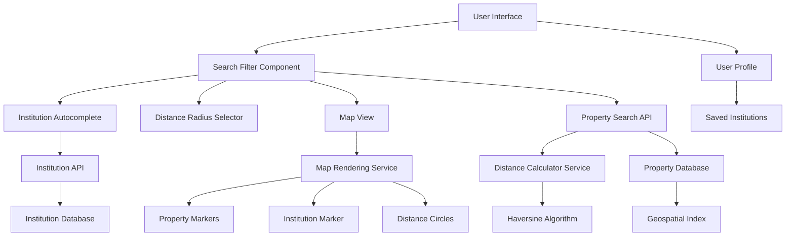
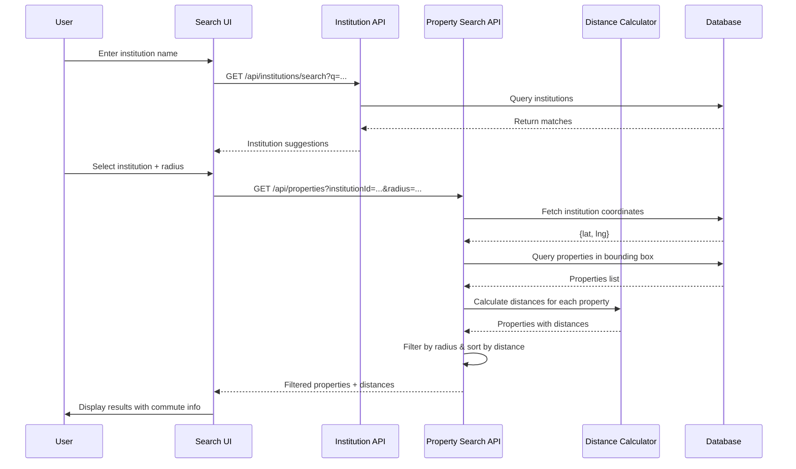

# Design Document: Near College/Office Filter

## Overview

The Near College/Office Filter enables users to search for rental properties based on proximity to educational institutions and workplaces across Uttar Pradesh. This feature addresses a critical use case for students seeking PG accommodations near their colleges and working professionals looking for housing near their offices. The system combines a curated institution database with geospatial distance calculations, providing users with distance-based filtering, radius selection, and commute time estimation. This feature integrates seamlessly with the existing property search infrastructure while introducing new models for institutions and saved user preferences.

## Architecture



## Main Algorithm/Workflow



## Components and Interfaces

### Component 1: Institution Model

**Purpose**: Store curated data for colleges, universities, and offices across UP

**Interface**:
```typescript
interface IInstitution extends Document {
  name: string;
  type: 'college' | 'university' | 'office' | 'corporate_park';
  location: {
    address: string;
    city: string;
    state: string;
    lat: number;
    lng: number;
  };
  aliases: string[]; // Alternative names for search
  isPopular: boolean;
  studentCount?: number;
  establishedYear?: number;
  logo?: string;
  createdAt: Date;
  updatedAt: Date;
}
```

**Responsibilities**:
- Store institution master data with precise coordinates
- Support fuzzy search via aliases
- Enable popularity-based sorting
- Provide metadata for UI display

### Component 2: User Saved Institutions

**Purpose**: Store user's frequently searched institutions for quick access

**Interface**:
```typescript
interface ISavedInstitution {
  institutionId: mongoose.Types.ObjectId;
  customName?: string; // User's custom label
  defaultRadius?: number; // User's preferred search radius
  addedAt: Date;
}

// Extension to User model
interface IUser extends Document {
  // ... existing fields
  savedInstitutions: ISavedInstitution[];
}
```

**Responsibilities**:
- Persist user's favorite institutions
- Store personalized search preferences
- Enable one-click search from saved list

### Component 3: Distance Calculator Service

**Purpose**: Calculate accurate distances between institutions and properties

**Interface**:
```typescript
interface DistanceCalculatorService {
  calculateDistance(
    point1: { lat: number; lng: number },
    point2: { lat: number; lng: number }
  ): number; // Returns distance in kilometers
  
  calculateCommute(
    distanceKm: number,
    mode: 'walking' | 'auto' | 'bus'
  ): number; // Returns time in minutes
  
  filterByRadius(
    properties: IProperty[],
    center: { lat: number; lng: number },
    radiusKm: number
  ): PropertyWithDistance[];
}

interface PropertyWithDistance extends IProperty {
  distanceKm: number;
  commuteTime: {
    walking: number;
    auto: number;
    bus: number;
  };
}
```

**Responsibilities**:
- Implement Haversine formula for accurate distance calculation
- Estimate commute times based on distance and mode
- Filter and sort properties by proximity

### Component 4: Institution Search Component

**Purpose**: Autocomplete UI for institution selection

**Interface**:
```typescript
interface InstitutionSearchProps {
  onSelect: (institution: IInstitution) => void;
  placeholder?: string;
  showSaved?: boolean;
  city?: string; // Filter by city
}

interface InstitutionSearchState {
  query: string;
  suggestions: IInstitution[];
  savedInstitutions: ISavedInstitution[];
  isLoading: boolean;
  selectedInstitution: IInstitution | null;
}
```

**Responsibilities**:
- Provide real-time autocomplete suggestions
- Display saved institutions for quick access
- Handle institution selection and validation
- Support city-based filtering

### Component 5: Distance Radius Selector

**Purpose**: UI component for selecting search radius

**Interface**:
```typescript
interface RadiusSelectorProps {
  value: number; // Current radius in km
  onChange: (radius: number) => void;
  presets?: number[]; // Default: [0.5, 1, 2, 5]
}

const DEFAULT_RADIUS_PRESETS = [
  { value: 0.5, label: '500m', description: 'Walking distance' },
  { value: 1, label: '1 km', description: 'Short walk' },
  { value: 2, label: '2 km', description: 'Auto distance' },
  { value: 5, label: '5 km', description: 'Bus distance' },
];
```

**Responsibilities**:
- Provide preset radius options
- Support custom radius input
- Display distance context (walking/auto/bus)

### Component 6: Property Map with Institution Marker

**Purpose**: Visual representation of properties relative to institution

**Interface**:
```typescript
interface PropertyMapWithInstitutionProps {
  properties: PropertyWithDistance[];
  institution: IInstitution;
  radius: number;
  onPropertyClick: (property: IProperty) => void;
}
```

**Responsibilities**:
- Display institution marker at center
- Show properties as markers with distance labels
- Render radius circle around institution
- Support property selection from map

## Data Models

### Model 1: Institution

```typescript
import mongoose, { Schema, Document } from 'mongoose';

export interface IInstitution extends Document {
  name: string;
  type: 'college' | 'university' | 'office' | 'corporate_park';
  location: {
    address: string;
    city: string;
    state: string;
    lat: number;
    lng: number;
  };
  aliases: string[];
  isPopular: boolean;
  studentCount?: number;
  establishedYear?: number;
  logo?: string;
  createdAt: Date;
  updatedAt: Date;
}

const InstitutionSchema = new Schema<IInstitution>(
  {
    name: { type: String, required: true, trim: true },
    type: {
      type: String,
      enum: ['college', 'university', 'office', 'corporate_park'],
      required: true,
    },
    location: {
      address: { type: String, required: true },
      city: { type: String, required: true, index: true },
      state: { type: String, required: true },
      lat: { type: Number, required: true },
      lng: { type: Number, required: true },
    },
    aliases: [{ type: String }],
    isPopular: { type: Boolean, default: false, index: true },
    studentCount: { type: Number },
    establishedYear: { type: Number },
    logo: { type: String },
  },
  { timestamps: true }
);

// Text index for fuzzy search
InstitutionSchema.index({ name: 'text', aliases: 'text' });

// Geospatial index for location-based queries
InstitutionSchema.index({ 'location.lat': 1, 'location.lng': 1 });

export default mongoose.model<IInstitution>('Institution', InstitutionSchema);
```

**Validation Rules**:
- name must be non-empty and unique per city
- lat must be between -90 and 90
- lng must be between -180 and 180
- city must be a valid UP city
- type must be one of the enum values

### Model 2: User Extension (Saved Institutions)

```typescript
// Extension to existing User model
const SavedInstitutionSchema = new Schema({
  institutionId: { type: Schema.Types.ObjectId, ref: 'Institution', required: true },
  customName: { type: String },
  defaultRadius: { type: Number, default: 2 }, // km
  addedAt: { type: Date, default: Date.now },
});

// Add to User schema
UserSchema.add({
  savedInstitutions: [SavedInstitutionSchema],
});
```

**Validation Rules**:
- institutionId must reference valid Institution
- defaultRadius must be between 0.1 and 50 km
- Maximum 10 saved institutions per user

## Key Functions with Formal Specifications

### Function 1: calculateHaversineDistance()

```typescript
function calculateHaversineDistance(
  point1: { lat: number; lng: number },
  point2: { lat: number; lng: number }
): number
```

**Preconditions:**
- `point1.lat` and `point2.lat` are in range [-90, 90]
- `point1.lng` and `point2.lng` are in range [-180, 180]
- All coordinate values are valid numbers (not NaN or Infinity)

**Postconditions:**
- Returns distance in kilometers as a positive number
- Result is accurate within 0.5% for distances < 1000km
- Returns 0 if points are identical
- Never returns negative values or NaN

**Loop Invariants:** N/A (no loops)

### Function 2: filterPropertiesByRadius()

```typescript
function filterPropertiesByRadius(
  properties: IProperty[],
  center: { lat: number; lng: number },
  radiusKm: number
): PropertyWithDistance[]
```

**Preconditions:**
- `properties` is a valid array (may be empty)
- `center` has valid lat/lng coordinates
- `radiusKm` is a positive number > 0
- All properties have valid location.lat and location.lng

**Postconditions:**
- Returns array of properties within radius, sorted by distance (ascending)
- Each returned property has `distanceKm` field populated
- All returned properties satisfy: `distanceKm <= radiusKm`
- Original properties array is not mutated
- If no properties within radius, returns empty array

**Loop Invariants:**
- For each iteration: all processed properties have valid distanceKm calculated
- Filtered array maintains only properties where distanceKm <= radiusKm

### Function 3: estimateCommuteTime()

```typescript
function estimateCommuteTime(
  distanceKm: number,
  mode: 'walking' | 'auto' | 'bus'
): number
```

**Preconditions:**
- `distanceKm` is a non-negative number
- `mode` is one of the three valid transport modes

**Postconditions:**
- Returns estimated time in minutes as a positive integer
- Walking: assumes 5 km/h average speed
- Auto: assumes 20 km/h average speed (accounting for traffic)
- Bus: assumes 15 km/h average speed (accounting for stops)
- Returns 0 if distanceKm is 0

**Loop Invariants:** N/A (no loops)

### Function 4: searchInstitutions()

```typescript
async function searchInstitutions(
  query: string,
  city?: string,
  limit: number = 10
): Promise<IInstitution[]>
```

**Preconditions:**
- `query` is a non-empty string (trimmed)
- `limit` is a positive integer <= 50
- `city` (if provided) is a valid string

**Postconditions:**
- Returns array of institutions matching query
- Results are sorted by: isPopular DESC, relevance score DESC
- Array length <= limit
- If city provided, all results are from that city
- Returns empty array if no matches found

**Loop Invariants:** N/A (database query)

## Algorithmic Pseudocode

### Main Processing Algorithm: Property Search with Institution Filter

```typescript
ALGORITHM searchPropertiesNearInstitution(institutionId, radiusKm, additionalFilters)
INPUT: 
  - institutionId: ObjectId of the institution
  - radiusKm: search radius in kilometers
  - additionalFilters: existing property filters (price, bedrooms, etc.)
OUTPUT: 
  - Array of PropertyWithDistance objects sorted by distance

BEGIN
  // Step 1: Fetch institution coordinates
  institution ← await Institution.findById(institutionId)
  ASSERT institution !== null AND institution.location.lat !== null
  
  center ← { lat: institution.location.lat, lng: institution.location.lng }
  
  // Step 2: Calculate bounding box for efficient query
  // Approximate: 1 degree latitude ≈ 111 km
  latDelta ← radiusKm / 111
  lngDelta ← radiusKm / (111 * cos(center.lat * π / 180))
  
  boundingBox ← {
    minLat: center.lat - latDelta,
    maxLat: center.lat + latDelta,
    minLng: center.lng - lngDelta,
    maxLng: center.lng + lngDelta
  }
  
  // Step 3: Query properties within bounding box
  properties ← await Property.find({
    'location.lat': { $gte: boundingBox.minLat, $lte: boundingBox.maxLat },
    'location.lng': { $gte: boundingBox.minLng, $lte: boundingBox.maxLng },
    isAvailable: true,
    ...additionalFilters
  })
  
  // Step 4: Calculate exact distances and filter by radius
  propertiesWithDistance ← []
  
  FOR each property IN properties DO
    ASSERT property.location.lat !== null AND property.location.lng !== null
    
    distance ← calculateHaversineDistance(
      center,
      { lat: property.location.lat, lng: property.location.lng }
    )
    
    IF distance <= radiusKm THEN
      commuteTime ← {
        walking: estimateCommuteTime(distance, 'walking'),
        auto: estimateCommuteTime(distance, 'auto'),
        bus: estimateCommuteTime(distance, 'bus')
      }
      
      propertiesWithDistance.push({
        ...property,
        distanceKm: distance,
        commuteTime: commuteTime
      })
    END IF
  END FOR
  
  // Step 5: Sort by distance (ascending)
  propertiesWithDistance.sort((a, b) => a.distanceKm - b.distanceKm)
  
  ASSERT all items in propertiesWithDistance have distanceKm <= radiusKm
  
  RETURN propertiesWithDistance
END
```

**Preconditions:**
- institutionId references a valid institution with coordinates
- radiusKm is a positive number between 0.1 and 50
- additionalFilters is a valid MongoDB query object

**Postconditions:**
- Returns array of properties within radius
- All properties have distanceKm and commuteTime fields
- Array is sorted by distance (ascending)
- All returned properties satisfy distanceKm <= radiusKm

**Loop Invariants:**
- All processed properties have valid distance calculations
- propertiesWithDistance contains only properties within radius

### Distance Calculation Algorithm: Haversine Formula

```typescript
ALGORITHM calculateHaversineDistance(point1, point2)
INPUT: 
  - point1: { lat: number, lng: number }
  - point2: { lat: number, lng: number }
OUTPUT: 
  - distance in kilometers

BEGIN
  CONST EARTH_RADIUS_KM = 6371
  
  // Convert degrees to radians
  lat1Rad ← point1.lat * (π / 180)
  lat2Rad ← point2.lat * (π / 180)
  latDelta ← (point2.lat - point1.lat) * (π / 180)
  lngDelta ← (point2.lng - point1.lng) * (π / 180)
  
  // Haversine formula
  a ← sin(latDelta / 2)² + cos(lat1Rad) * cos(lat2Rad) * sin(lngDelta / 2)²
  c ← 2 * atan2(√a, √(1 - a))
  distance ← EARTH_RADIUS_KM * c
  
  ASSERT distance >= 0
  
  RETURN distance
END
```

**Preconditions:**
- point1.lat and point2.lat are in range [-90, 90]
- point1.lng and point2.lng are in range [-180, 180]

**Postconditions:**
- Returns non-negative distance in kilometers
- Accurate within 0.5% for distances < 1000km
- Returns 0 if points are identical

**Loop Invariants:** N/A

### Institution Search Algorithm

```typescript
ALGORITHM searchInstitutions(query, city, limit)
INPUT:
  - query: search string
  - city: optional city filter
  - limit: maximum results
OUTPUT:
  - Array of matching institutions

BEGIN
  ASSERT query.trim().length > 0
  ASSERT limit > 0 AND limit <= 50
  
  // Build search filter
  searchFilter ← {
    $text: { $search: query }
  }
  
  IF city !== null THEN
    searchFilter['location.city'] ← city
  END IF
  
  // Execute search with text score
  institutions ← await Institution.find(searchFilter)
    .select('name type location isPopular logo')
    .sort({ isPopular: -1, score: { $meta: 'textScore' } })
    .limit(limit)
  
  ASSERT institutions.length <= limit
  
  RETURN institutions
END
```

**Preconditions:**
- query is non-empty after trimming
- limit is positive integer <= 50
- city (if provided) is valid string

**Postconditions:**
- Returns array of institutions matching query
- Results sorted by popularity and relevance
- Array length <= limit

**Loop Invariants:** N/A (database operation)

## Example Usage

```typescript
// Example 1: Search properties near IIT Kanpur within 2km
const institution = await Institution.findOne({ name: 'IIT Kanpur' });
const properties = await searchPropertiesNearInstitution(
  institution._id,
  2, // 2km radius
  { price: { $lte: 10000 }, propertyType: 'apartment' }
);

console.log(`Found ${properties.length} properties`);
properties.forEach(p => {
  console.log(`${p.title} - ${p.distanceKm.toFixed(2)}km away`);
  console.log(`Walking: ${p.commuteTime.walking} min, Auto: ${p.commuteTime.auto} min`);
});

// Example 2: Institution autocomplete search
const suggestions = await searchInstitutions('IIT', 'Kanpur', 5);
// Returns: [IIT Kanpur, IITM Kanpur, ...]

// Example 3: Save institution to user profile
await User.findByIdAndUpdate(userId, {
  $push: {
    savedInstitutions: {
      institutionId: institution._id,
      customName: 'My College',
      defaultRadius: 1.5
    }
  }
});

// Example 4: Calculate distance between two points
const distance = calculateHaversineDistance(
  { lat: 26.5123, lng: 80.2329 }, // IIT Kanpur
  { lat: 26.5200, lng: 80.2400 }  // Property location
);
console.log(`Distance: ${distance.toFixed(2)} km`);

// Example 5: Filter properties by radius
const allProperties = await Property.find({ city: 'Kanpur' });
const nearbyProperties = filterPropertiesByRadius(
  allProperties,
  { lat: 26.5123, lng: 80.2329 },
  2 // 2km radius
);
```

## Correctness Properties

### Property 1: Distance Calculation Accuracy
```typescript
// For any two valid coordinate pairs, distance must be non-negative and symmetric
∀ p1, p2 ∈ ValidCoordinates:
  calculateHaversineDistance(p1, p2) >= 0 ∧
  calculateHaversineDistance(p1, p2) === calculateHaversineDistance(p2, p1)
```

### Property 2: Radius Filter Correctness
```typescript
// All returned properties must be within the specified radius
∀ property ∈ filterPropertiesByRadius(properties, center, radius):
  property.distanceKm <= radius
```

### Property 3: Sorted Results
```typescript
// Results must be sorted by distance in ascending order
∀ i, j ∈ [0, results.length - 1] where i < j:
  results[i].distanceKm <= results[j].distanceKm
```

### Property 4: Commute Time Consistency
```typescript
// Commute time must increase monotonically with distance
∀ d1, d2 ∈ ℝ+ where d1 < d2, ∀ mode ∈ TransportModes:
  estimateCommuteTime(d1, mode) <= estimateCommuteTime(d2, mode)
```

### Property 5: Bounding Box Containment
```typescript
// All properties within radius must be within bounding box
∀ property where distanceKm <= radius:
  property.location.lat ∈ [center.lat - latDelta, center.lat + latDelta] ∧
  property.location.lng ∈ [center.lng - lngDelta, center.lng + lngDelta]
```

### Property 6: Institution Search Relevance
```typescript
// Search results must match query in name or aliases
∀ institution ∈ searchInstitutions(query, city, limit):
  institution.name.includes(query) ∨ 
  institution.aliases.some(alias => alias.includes(query))
```

## Error Handling

### Error Scenario 1: Institution Not Found

**Condition**: User selects an institution that has been deleted or doesn't exist
**Response**: Return 404 error with message "Institution not found"
**Recovery**: Prompt user to search again or select from saved institutions

### Error Scenario 2: Invalid Coordinates

**Condition**: Property or institution has null/invalid lat/lng values
**Response**: Skip the property in distance calculations, log warning
**Recovery**: Continue processing remaining properties, notify admin for data cleanup

### Error Scenario 3: Radius Too Large

**Condition**: User requests radius > 50km
**Response**: Return 400 error with message "Maximum radius is 50km"
**Recovery**: Suggest user to use city-wide search instead

### Error Scenario 4: No Properties Found

**Condition**: No properties exist within specified radius
**Response**: Return empty array with 200 status
**Recovery**: Display "No properties found" message with suggestion to increase radius

### Error Scenario 5: Geolocation Service Failure

**Condition**: Unable to geocode custom institution address
**Response**: Return 503 error with message "Geocoding service unavailable"
**Recovery**: Fallback to manual coordinate entry or retry after delay

### Error Scenario 6: Database Query Timeout

**Condition**: Property search query exceeds timeout (e.g., 30s)
**Response**: Return 504 error with message "Search timeout, please try again"
**Recovery**: Implement query optimization with geospatial indexes

## Testing Strategy

### Unit Testing Approach

Test individual functions in isolation with comprehensive edge cases:

1. **Distance Calculation Tests**
   - Test with known coordinate pairs (e.g., IIT Kanpur to nearby landmarks)
   - Verify symmetry: distance(A, B) === distance(B, A)
   - Test edge cases: same point (distance = 0), antipodal points
   - Test boundary coordinates: equator, poles, date line

2. **Radius Filter Tests**
   - Test with properties at exact radius boundary
   - Test with empty property array
   - Test with all properties outside radius
   - Verify sorting order

3. **Commute Time Tests**
   - Test each transport mode with various distances
   - Verify monotonic increase with distance
   - Test zero distance (should return 0)

4. **Institution Search Tests**
   - Test exact name match
   - Test partial name match
   - Test alias matching
   - Test city filtering
   - Test limit enforcement

### Property-Based Testing Approach

Use property-based testing to verify invariants across random inputs:

**Property Test Library**: fast-check (for TypeScript/JavaScript)

1. **Distance Symmetry Property**
   ```typescript
   fc.assert(
     fc.property(
       fc.record({ lat: fc.float(-90, 90), lng: fc.float(-180, 180) }),
       fc.record({ lat: fc.float(-90, 90), lng: fc.float(-180, 180) }),
       (p1, p2) => {
         const d1 = calculateHaversineDistance(p1, p2);
         const d2 = calculateHaversineDistance(p2, p1);
         return Math.abs(d1 - d2) < 0.001; // Allow small floating point error
       }
     )
   );
   ```

2. **Triangle Inequality Property**
   ```typescript
   fc.assert(
     fc.property(
       fc.record({ lat: fc.float(-90, 90), lng: fc.float(-180, 180) }),
       fc.record({ lat: fc.float(-90, 90), lng: fc.float(-180, 180) }),
       fc.record({ lat: fc.float(-90, 90), lng: fc.float(-180, 180) }),
       (p1, p2, p3) => {
         const d12 = calculateHaversineDistance(p1, p2);
         const d23 = calculateHaversineDistance(p2, p3);
         const d13 = calculateHaversineDistance(p1, p3);
         return d13 <= d12 + d23 + 0.1; // Triangle inequality with tolerance
       }
     )
   );
   ```

3. **Radius Filter Correctness Property**
   ```typescript
   fc.assert(
     fc.property(
       fc.array(generateMockProperty()),
       fc.record({ lat: fc.float(-90, 90), lng: fc.float(-180, 180) }),
       fc.float(0.1, 50),
       (properties, center, radius) => {
         const filtered = filterPropertiesByRadius(properties, center, radius);
         return filtered.every(p => p.distanceKm <= radius);
       }
     )
   );
   ```

### Integration Testing Approach

Test end-to-end workflows with real database interactions:

1. **Institution Search to Property Filter Flow**
   - Seed database with test institutions and properties
   - Search for institution by name
   - Apply distance filter with various radii
   - Verify results match expected properties

2. **Saved Institution Workflow**
   - Create user and save institution
   - Retrieve saved institutions
   - Use saved institution for property search
   - Verify custom radius is applied

3. **Map View Integration**
   - Fetch properties near institution
   - Render map with markers
   - Verify radius circle is accurate
   - Test property selection from map

4. **API Endpoint Tests**
   - Test GET /api/institutions/search with various queries
   - Test GET /api/properties with institutionId and radius params
   - Test POST /api/users/saved-institutions
   - Verify response formats and status codes

## Performance Considerations

1. **Geospatial Indexing**
   - Create 2dsphere index on Property.location for efficient spatial queries
   - Use bounding box pre-filter before Haversine calculations
   - Expected query time: < 100ms for 10,000 properties

2. **Institution Search Optimization**
   - Text index on name and aliases fields
   - Cache popular institutions in Redis (TTL: 1 hour)
   - Limit autocomplete results to 10 items

3. **Distance Calculation Optimization**
   - Calculate distances only for properties within bounding box
   - Use approximate distance for initial filtering, exact for final results
   - Consider caching distances for frequently searched institution-property pairs

4. **Database Query Optimization**
   - Use projection to fetch only required fields
   - Implement pagination for large result sets
   - Set query timeout to 30 seconds

5. **Frontend Performance**
   - Debounce institution search input (300ms)
   - Lazy load map component
   - Virtualize property list for large result sets

## Security Considerations

1. **Input Validation**
   - Sanitize institution search queries to prevent NoSQL injection
   - Validate radius parameter (0.1 <= radius <= 50)
   - Validate coordinate ranges before distance calculations

2. **Rate Limiting**
   - Limit institution search to 60 requests/minute per user
   - Limit property search to 30 requests/minute per user
   - Implement exponential backoff for repeated failures

3. **Data Privacy**
   - Do not expose exact property coordinates in public API
   - Round coordinates to 4 decimal places (~11m precision)
   - Require authentication for saved institutions feature

4. **Authorization**
   - Only authenticated users can save institutions
   - Users can only access their own saved institutions
   - Admin role required to create/edit institution data

## Dependencies

1. **External Libraries**
   - mongoose: MongoDB ODM for data models
   - fast-check: Property-based testing library

2. **Internal Services**
   - Existing Property model and search infrastructure
   - User authentication and authorization system
   - Map rendering service (Leaflet or Mapbox)

3. **Third-Party Services**
   - Geocoding API (optional): For custom institution address lookup
   - Map tiles provider: OpenStreetMap or Mapbox

4. **Database Requirements**
   - MongoDB 4.4+ with geospatial query support
   - Redis (optional): For caching popular institutions

5. **Infrastructure**
   - Geospatial indexes on Property and Institution collections
   - Background job for institution data updates
