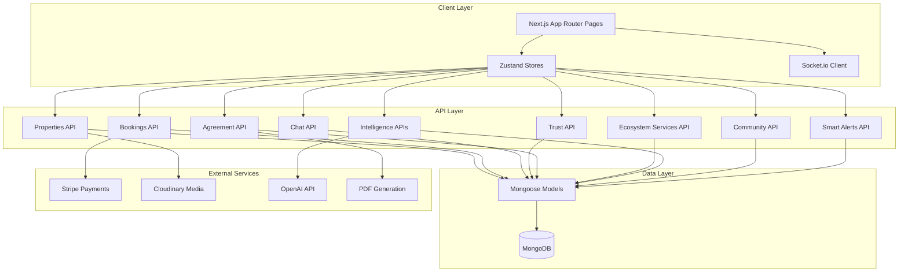
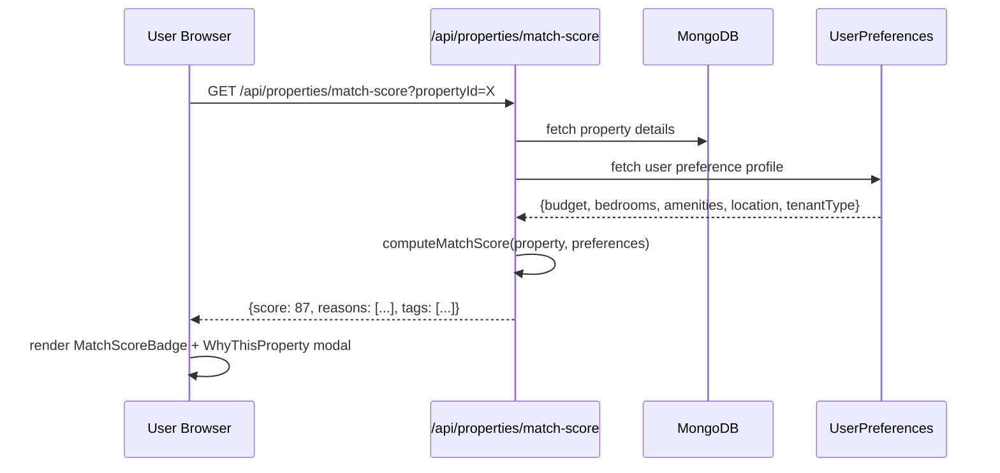
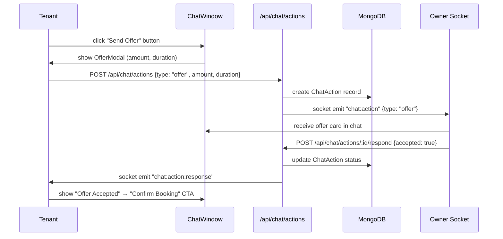
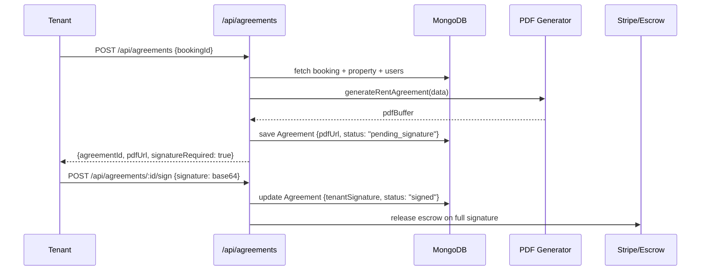
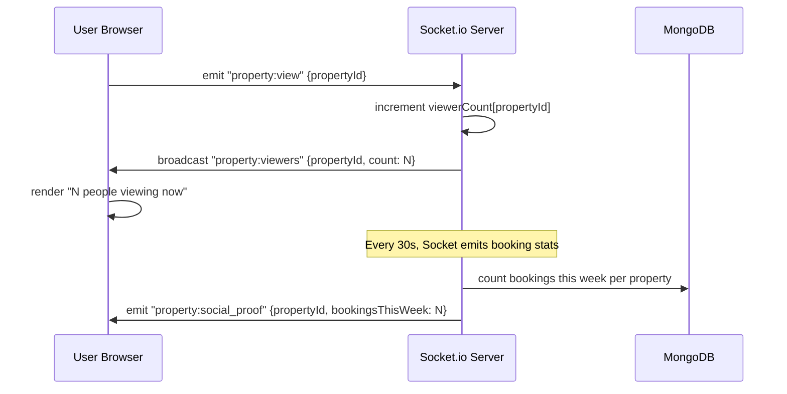

# Design Document: StayFinder Rental Ecosystem Upgrade

## Overview

This document describes the comprehensive upgrade of StayFinder — a Next.js 16 App Router room rental platform — to surpass Airbnb/MagicBricks with 15 advanced feature clusters. The upgrade builds on the existing foundation (JWT auth, property listings, booking/escrow, Stripe, Socket.io chat, notifications, analytics, AI price suggestions, owner verification, availability calendar, admin panel) and adds intelligence, trust, legal automation, community, and emotional UX layers.

The architecture follows the existing patterns: Next.js App Router API routes, Mongoose models, Zustand stores, Tailwind CSS v4, Framer Motion animations, and Socket.io for real-time features. All new `cn` imports use `@/utils/cn`.

## Architecture



## Sequence Diagrams

### Decision Engine: Match Score Calculation



### Chat as Transaction Engine



### Legal Agreement Generation



### Real-time Urgency Signals



## Components and Interfaces

### 1. Decision Engine

**Purpose**: Compute a 0–100% match score per property based on stored user preferences, and surface smart tags and explanations.

**Interface**:
```typescript
interface MatchScore {
  score: number                    // 0-100
  reasons: string[]                // ["Matches your budget", "Has WiFi you prefer"]
  tags: SmartTag[]                 // ["Best for students", "Near office"]
  breakdown: {
    budget: number                 // 0-25 points
    bedrooms: number               // 0-20 points
    amenities: number              // 0-20 points
    location: number               // 0-20 points
    tenantType: number             // 0-15 points
  }
}

type SmartTag = "Best for students" | "Good for family" | "Near office" | "Pet friendly" | "Budget pick" | "Premium stay"

interface UserPreferences {
  userId: string
  budget: { min: number; max: number }
  preferredBedrooms: number
  preferredAmenities: string[]
  preferredCities: string[]
  tenantType: "student" | "family" | "professional" | "couple"
  savedSearches: SavedSearch[]
}
```

**Responsibilities**:
- Store and update user preference profiles
- Score each property against preferences on listing page
- Generate human-readable explanation strings
- Assign smart tags based on property attributes + area data

---

### 2. Rental Ecosystem Services

**Purpose**: Post-booking revenue layer — cleaning, maintenance, moving, furniture rental bookable from the booking confirmation page.

**Interface**:
```typescript
interface EcosystemService {
  _id: string
  type: "cleaning" | "maintenance" | "moving" | "furniture_rental"
  title: string
  description: string
  price: number
  priceUnit: "per_visit" | "per_hour" | "per_day" | "per_month"
  providerId: string               // third-party or platform provider
  availableCities: string[]
}

interface ServiceBooking {
  _id: string
  bookingId: string                // linked to main rental booking
  serviceId: string
  tenantId: string
  scheduledDate: Date
  status: "pending" | "confirmed" | "completed" | "cancelled"
  totalPrice: number
  paymentStatus: "unpaid" | "paid"
  notes?: string
}
```

---

### 3. Trust Layer

**Purpose**: Multi-dimensional trust signals for both owners and tenants, fraud detection, and profile completeness scoring.

**Interface**:
```typescript
interface TrustProfile {
  userId: string
  ownerVerified: boolean           // existing — admin approved
  tenantVerified: boolean          // NEW — ID + rental history verified
  fraudRiskLevel: "low" | "medium" | "high"
  fraudRiskReasons: string[]
  profileCompleteness: number      // 0-100
  safeDealEligible: boolean        // all trust checks passed
  badges: TrustBadge[]
}

type TrustBadge = 
  | "verified_owner"
  | "verified_tenant" 
  | "safe_deal_guarantee"
  | "top_rated"
  | "quick_responder"

interface FraudSignal {
  type: "new_account" | "no_reviews" | "price_anomaly" | "unverified_id" | "multiple_reports"
  severity: "low" | "medium" | "high"
  message: string
}
```

---

### 4. Chat as Transaction Engine

**Purpose**: Extend the existing ChatWindow with action buttons that create structured transaction records (visit scheduling, rent negotiation, agreement generation, booking confirmation).

**Interface**:
```typescript
interface ChatAction {
  _id: string
  conversationId: string
  initiatorId: string
  receiverId: string
  type: "schedule_visit" | "send_offer" | "generate_agreement" | "confirm_booking"
  status: "pending" | "accepted" | "rejected" | "expired"
  payload: VisitPayload | OfferPayload | AgreementPayload | BookingPayload
  createdAt: Date
  expiresAt: Date                  // 48h default
}

interface OfferPayload {
  proposedRent: number
  duration: number                 // months
  moveInDate: Date
  message?: string
}

interface VisitPayload {
  proposedDate: Date
  proposedTime: string
  message?: string
}
```

---

### 5. Price Intelligence

**Purpose**: Show fair price indicators, price trend graphs, and comparative labels on property listings and detail pages.

**Interface**:
```typescript
interface PriceIntelligence {
  propertyId: string
  cityAvgPrice: number             // avg price/night for similar properties in city
  fairPriceRange: { min: number; max: number }
  pricePosition: "below_average" | "average" | "above_average"
  percentageDiff: number           // e.g. -10 means "10% cheaper than average"
  trend: PriceTrendPoint[]
  lastUpdated: Date
}

interface PriceTrendPoint {
  month: string                    // "2024-01"
  avgPrice: number
}
```

---

### 6. Smart Owner Tools

**Purpose**: Demand insights, best listing time suggestions, and occupancy analytics for property owners.

**Interface**:
```typescript
interface DemandInsight {
  propertyId: string
  cityDemandScore: number          // 0-100
  peakMonths: string[]             // ["December", "January"]
  bestListingTime: string          // "List in November for peak season"
  competitorCount: number          // similar properties in same city
  avgOccupancyRate: number         // city-wide
  ownerOccupancyRate: number       // this property
  viewsThisWeek: number
  wishlistsThisWeek: number
}
```

---

### 7. Availability Intelligence

**Purpose**: Highlight high-demand dates on the availability calendar.

**Interface**:
```typescript
interface AvailabilityIntelligence {
  propertyId: string
  highDemandDates: Date[]          // dates with >3x normal booking requests
  bookedDates: Date[]              // existing blocked dates
  demandHeatmap: Record<string, "low" | "medium" | "high">  // date → demand level
}
```

---

### 8. Emotional UX

**Purpose**: Recently viewed tracking, real-time viewer counts, and social proof signals.

**Interface**:
```typescript
interface RecentlyViewed {
  userId: string
  properties: Array<{
    propertyId: string
    viewedAt: Date
  }>                               // max 20, FIFO
}

interface UrgencySignals {
  propertyId: string
  viewersNow: number               // real-time via Socket.io
  bookingsThisWeek: number
  availableUnits?: number          // for multi-unit properties
}
```

---

### 9. Location Intelligence

**Purpose**: Nearby amenities (metro, schools, hospitals) and area safety scores per property.

**Interface**:
```typescript
interface LocationIntelligence {
  propertyId: string
  nearbyAmenities: NearbyAmenity[]
  safetyScore: number              // 0-100
  safetyLabel: "Very Safe" | "Safe" | "Moderate" | "Use Caution"
  walkScore?: number
}

interface NearbyAmenity {
  type: "metro" | "school" | "hospital" | "mall" | "park" | "restaurant"
  name: string
  distanceKm: number
  walkTimeMinutes: number
}
```

---

### 10. Legal & Agreement Automation

**Purpose**: Auto-generate rent agreements, collect e-signatures, and provide PDF download.

**Interface**:
```typescript
interface RentAgreement {
  _id: string
  bookingId: string
  propertyId: string
  tenantId: string
  ownerId: string
  agreementText: string            // generated from template
  pdfUrl: string                   // Cloudinary URL
  tenantSignature?: string         // base64 SVG or typed name
  ownerSignature?: string
  tenantSignedAt?: Date
  ownerSignedAt?: Date
  status: "draft" | "pending_tenant" | "pending_owner" | "fully_signed" | "expired"
  validFrom: Date
  validUntil: Date
  createdAt: Date
}
```

---

### 11. Smart Notifications

**Purpose**: Price drop alerts and new property alerts for saved searches.

**Interface**:
```typescript
interface SavedSearch {
  _id: string
  userId: string
  filters: {
    city?: string
    minPrice?: number
    maxPrice?: number
    bedrooms?: number
    propertyType?: string
    amenities?: string[]
  }
  alertEnabled: boolean
  lastAlertedAt?: Date
}

interface PriceDropAlert {
  propertyId: string
  userId: string
  previousPrice: number
  newPrice: number
  dropPercentage: number
}
```

---

### 12. AI Features

**Purpose**: Natural language property search chatbot and auto description generator for owners.

**Interface**:
```typescript
interface AISearchQuery {
  naturalLanguage: string          // "Find me 2BHK under ₹10k in Delhi"
  parsedFilters: {
    bedrooms?: number
    maxPrice?: number
    city?: string
    amenities?: string[]
    propertyType?: string
  }
  confidence: number               // 0-1
}

interface AIDescriptionRequest {
  propertyType: string
  bedrooms: number
  bathrooms: number
  amenities: string[]
  location: { city: string; state: string }
  price: number
  highlights?: string              // owner's notes
}
```

---

### 13. Community Layer

**Purpose**: Tenant reviews of localities, Q&A per neighborhood, and neighborhood ratings.

**Interface**:
```typescript
interface LocalityReview {
  _id: string
  userId: string
  city: string
  locality: string                 // neighborhood name
  ratings: {
    safety: number                 // 1-5
    connectivity: number
    amenities: number
    cleanliness: number
    overall: number
  }
  comment: string
  createdAt: Date
}

interface LocalityQA {
  _id: string
  city: string
  locality: string
  question: string
  askedBy: string
  answers: Array<{
    userId: string
    answer: string
    upvotes: number
    createdAt: Date
  }>
  createdAt: Date
}
```

---

### 14. Zero Risk Rental System (Enhanced Escrow)

**Purpose**: Move-in confirmation flow and dispute/refund UI on top of existing Stripe escrow.

**Interface**:
```typescript
interface MoveInConfirmation {
  bookingId: string
  tenantConfirmedAt?: Date
  ownerConfirmedAt?: Date
  status: "pending" | "tenant_confirmed" | "owner_confirmed" | "both_confirmed" | "disputed"
  checkInPhotos: string[]          // Cloudinary URLs uploaded by tenant
}

interface Dispute {
  _id: string
  bookingId: string
  raisedBy: string                 // userId
  reason: "property_mismatch" | "no_access" | "safety_issue" | "fraud" | "other"
  description: string
  evidence: string[]               // Cloudinary URLs
  status: "open" | "under_review" | "resolved_refund" | "resolved_no_refund" | "closed"
  adminNotes?: string
  resolution?: string
  createdAt: Date
  resolvedAt?: Date
}
```

## Data Models

### New/Extended Mongoose Models

#### UserPreferences (new)
```typescript
{
  userId: ObjectId                 // ref: User
  budget: { min: Number, max: Number }
  preferredBedrooms: Number
  preferredAmenities: [String]
  preferredCities: [String]
  tenantType: "student" | "family" | "professional" | "couple"
  recentlyViewed: [{ propertyId: ObjectId, viewedAt: Date }]  // max 20
  savedSearches: [SavedSearchSchema]
}
```

#### EcosystemService (new)
```typescript
{
  type: "cleaning" | "maintenance" | "moving" | "furniture_rental"
  title: String
  description: String
  price: Number
  priceUnit: "per_visit" | "per_hour" | "per_day" | "per_month"
  availableCities: [String]
  isActive: Boolean
}
```

#### ServiceBooking (new)
```typescript
{
  bookingId: ObjectId              // ref: Booking
  serviceId: ObjectId              // ref: EcosystemService
  tenantId: ObjectId               // ref: User
  scheduledDate: Date
  status: "pending" | "confirmed" | "completed" | "cancelled"
  totalPrice: Number
  paymentStatus: "unpaid" | "paid"
  notes: String
}
```

#### ChatAction (new)
```typescript
{
  conversationId: String
  initiatorId: ObjectId            // ref: User
  receiverId: ObjectId             // ref: User
  type: "schedule_visit" | "send_offer" | "generate_agreement" | "confirm_booking"
  status: "pending" | "accepted" | "rejected" | "expired"
  payload: Mixed                   // type-specific data
  expiresAt: Date
}
```

#### RentAgreement (new)
```typescript
{
  bookingId: ObjectId              // ref: Booking
  propertyId: ObjectId             // ref: Property
  tenantId: ObjectId               // ref: User
  ownerId: ObjectId                // ref: User
  agreementText: String
  pdfUrl: String
  tenantSignature: String
  ownerSignature: String
  tenantSignedAt: Date
  ownerSignedAt: Date
  status: "draft" | "pending_tenant" | "pending_owner" | "fully_signed" | "expired"
  validFrom: Date
  validUntil: Date
}
```

#### LocalityReview (new)
```typescript
{
  userId: ObjectId                 // ref: User
  city: String
  locality: String
  ratings: {
    safety: Number, connectivity: Number,
    amenities: Number, cleanliness: Number, overall: Number
  }
  comment: String
}
```

#### LocalityQA (new)
```typescript
{
  city: String
  locality: String
  question: String
  askedBy: ObjectId                // ref: User
  answers: [{
    userId: ObjectId, answer: String,
    upvotes: Number, createdAt: Date
  }]
}
```

#### Dispute (new)
```typescript
{
  bookingId: ObjectId              // ref: Booking
  raisedBy: ObjectId               // ref: User
  reason: "property_mismatch" | "no_access" | "safety_issue" | "fraud" | "other"
  description: String
  evidence: [String]               // Cloudinary URLs
  status: "open" | "under_review" | "resolved_refund" | "resolved_no_refund" | "closed"
  adminNotes: String
  resolution: String
  resolvedAt: Date
}
```

#### SavedSearch (embedded in UserPreferences)
```typescript
{
  filters: {
    city: String, minPrice: Number, maxPrice: Number,
    bedrooms: Number, propertyType: String, amenities: [String]
  }
  alertEnabled: Boolean
  lastAlertedAt: Date
}
```

### Extended Existing Models

#### Property (additions)
```typescript
{
  // NEW fields to add:
  locationIntelligence: {
    nearbyAmenities: [{ type: String, name: String, distanceKm: Number, walkTimeMinutes: Number }]
    safetyScore: Number
    safetyLabel: String
    lastUpdated: Date
  }
  priceIntelligence: {
    cityAvgPrice: Number
    fairPriceRange: { min: Number, max: Number }
    pricePosition: String
    percentageDiff: Number
    trend: [{ month: String, avgPrice: Number }]
    lastUpdated: Date
  }
  viewCount: Number                // total views
  weeklyBookings: Number           // bookings in last 7 days
  unitCount: Number                // for multi-unit properties
}
```

#### Booking (additions)
```typescript
{
  // NEW fields to add:
  moveInConfirmation: {
    tenantConfirmedAt: Date
    ownerConfirmedAt: Date
    status: "pending" | "tenant_confirmed" | "owner_confirmed" | "both_confirmed" | "disputed"
    checkInPhotos: [String]
  }
  disputeId: ObjectId              // ref: Dispute
}
```

#### User (additions)
```typescript
{
  // NEW fields to add:
  tenantVerified: Boolean
  tenantVerificationDoc: String
  fraudRiskLevel: "low" | "medium" | "high"
  profileCompleteness: Number      // 0-100, computed
  trustBadges: [String]
}
```

## Algorithmic Pseudocode

### Match Score Algorithm

```pascal
ALGORITHM computeMatchScore(property, userPreferences)
INPUT: property: IProperty, userPreferences: UserPreferences
OUTPUT: MatchScore (score: 0-100, reasons, tags, breakdown)

BEGIN
  breakdown ← { budget: 0, bedrooms: 0, amenities: 0, location: 0, tenantType: 0 }
  reasons ← []
  tags ← []

  // Budget scoring (max 25 points)
  IF property.price >= userPreferences.budget.min AND
     property.price <= userPreferences.budget.max THEN
    breakdown.budget ← 25
    reasons.add("Within your budget range")
  ELSE IF property.price <= userPreferences.budget.max * 1.1 THEN
    breakdown.budget ← 15
    reasons.add("Slightly above budget")
  END IF

  // Bedroom scoring (max 20 points)
  IF property.bedrooms = userPreferences.preferredBedrooms THEN
    breakdown.bedrooms ← 20
    reasons.add("Exact bedroom match")
  ELSE IF ABS(property.bedrooms - userPreferences.preferredBedrooms) = 1 THEN
    breakdown.bedrooms ← 10
  END IF

  // Amenities scoring (max 20 points)
  matchedAmenities ← INTERSECTION(property.amenities, userPreferences.preferredAmenities)
  amenityRatio ← LENGTH(matchedAmenities) / MAX(LENGTH(userPreferences.preferredAmenities), 1)
  breakdown.amenities ← FLOOR(amenityRatio * 20)
  IF amenityRatio >= 0.8 THEN
    reasons.add("Has most amenities you prefer")
  END IF

  // Location scoring (max 20 points)
  IF property.location.city IN userPreferences.preferredCities THEN
    breakdown.location ← 20
    reasons.add("In your preferred city")
  END IF

  // Tenant type scoring (max 15 points)
  SWITCH userPreferences.tenantType
    CASE "student":
      IF property.price < cityAvgPrice * 0.8 THEN
        breakdown.tenantType ← 15
        tags.add("Best for students")
      END IF
    CASE "family":
      IF property.bedrooms >= 2 AND "kitchen" IN property.amenities THEN
        breakdown.tenantType ← 15
        tags.add("Good for family")
      END IF
    CASE "professional":
      IF property.locationIntelligence.nearbyAmenities HAS metro THEN
        breakdown.tenantType ← 15
        tags.add("Near office")
      END IF
  END SWITCH

  totalScore ← SUM(breakdown.values)
  ASSERT totalScore >= 0 AND totalScore <= 100

  RETURN { score: totalScore, reasons, tags, breakdown }
END
```

**Preconditions:**
- `property` is a valid IProperty document
- `userPreferences` exists for the user (defaults used if not set)

**Postconditions:**
- `score` is in range [0, 100]
- `reasons` contains at least one entry if score > 0
- `breakdown` values sum to `score`

---

### Profile Completeness Algorithm

```pascal
ALGORITHM computeProfileCompleteness(user)
INPUT: user: IUser
OUTPUT: completeness: 0-100

BEGIN
  score ← 0
  weights ← {
    avatar: 15, username: 10, email: 10,
    phone: 15, bio: 10, ownerVerified: 20,
    tenantVerified: 20
  }

  FOR each field IN weights DO
    IF user[field] IS NOT NULL AND user[field] IS NOT EMPTY THEN
      score ← score + weights[field]
    END IF
  END FOR

  ASSERT score >= 0 AND score <= 100
  RETURN score
END
```

---

### Fraud Risk Assessment

```pascal
ALGORITHM assessFraudRisk(user, property)
INPUT: user: IUser, property: IProperty (optional)
OUTPUT: { level: "low"|"medium"|"high", signals: FraudSignal[] }

BEGIN
  signals ← []
  riskScore ← 0

  // Account age check
  accountAgeDays ← DAYS_SINCE(user.createdAt)
  IF accountAgeDays < 7 THEN
    signals.add({ type: "new_account", severity: "medium" })
    riskScore ← riskScore + 30
  END IF

  // Review history
  reviewCount ← COUNT(reviews WHERE userId = user._id)
  IF reviewCount = 0 AND accountAgeDays > 30 THEN
    signals.add({ type: "no_reviews", severity: "low" })
    riskScore ← riskScore + 10
  END IF

  // Verification status
  IF NOT user.ownerVerified AND user.role = "owner" THEN
    signals.add({ type: "unverified_id", severity: "high" })
    riskScore ← riskScore + 40
  END IF

  // Price anomaly (for properties)
  IF property IS NOT NULL THEN
    IF property.price < property.priceIntelligence.fairPriceRange.min * 0.5 THEN
      signals.add({ type: "price_anomaly", severity: "high" })
      riskScore ← riskScore + 40
    END IF
  END IF

  level ← IF riskScore >= 60 THEN "high"
           ELSE IF riskScore >= 30 THEN "medium"
           ELSE "low"

  RETURN { level, signals }
END
```

---

### Smart Notification Dispatch

```pascal
ALGORITHM dispatchSmartAlerts()
INPUT: none (runs as scheduled job every hour)
OUTPUT: notifications dispatched

BEGIN
  // Price drop alerts
  recentPriceChanges ← Property.find({ updatedAt > NOW - 1 HOUR })
  FOR each property IN recentPriceChanges DO
    IF property.price < property.previousPrice THEN
      dropPct ← (property.previousPrice - property.price) / property.previousPrice * 100
      IF dropPct >= 5 THEN
        wishlistedUsers ← User.find({ wishlist: property._id })
        FOR each user IN wishlistedUsers DO
          createNotification(user._id, "price_drop", {
            propertyId: property._id,
            drop: dropPct
          })
        END FOR
      END IF
    END IF
  END FOR

  // New property alerts for saved searches
  newProperties ← Property.find({ createdAt > NOW - 1 HOUR })
  savedSearches ← UserPreferences.find({ "savedSearches.alertEnabled": true })
  FOR each pref IN savedSearches DO
    FOR each search IN pref.savedSearches WHERE alertEnabled = true DO
      matches ← FILTER(newProperties, matchesFilters(search.filters))
      IF LENGTH(matches) > 0 THEN
        createNotification(pref.userId, "new_property_match", { count: LENGTH(matches) })
        search.lastAlertedAt ← NOW
      END IF
    END FOR
  END FOR
END
```

**Loop Invariants:**
- All processed properties remain unchanged
- Notifications are idempotent (no duplicate alerts within 24h per user/property pair)

## Key Functions with Formal Specifications

### `computeMatchScore(property, preferences)`

```typescript
function computeMatchScore(property: IProperty, preferences: UserPreferences): MatchScore
```

**Preconditions:**
- `property._id` is a valid MongoDB ObjectId
- `preferences.budget.min <= preferences.budget.max`
- `preferences.preferredBedrooms >= 0`

**Postconditions:**
- `result.score` ∈ [0, 100]
- `result.breakdown.budget + result.breakdown.bedrooms + result.breakdown.amenities + result.breakdown.location + result.breakdown.tenantType === result.score`
- `result.reasons.length > 0` if `result.score > 0`

**Loop Invariants:**
- Amenity intersection loop: all previously matched amenities remain in `matchedAmenities`

---

### `generateRentAgreement(bookingId)`

```typescript
async function generateRentAgreement(bookingId: string): Promise<{ pdfUrl: string; agreementId: string }>
```

**Preconditions:**
- Booking with `bookingId` exists and has `status === "approved"`
- Both tenant and owner user records exist
- Property record exists

**Postconditions:**
- A `RentAgreement` document is created with `status === "pending_tenant"`
- `pdfUrl` is a valid Cloudinary URL
- Agreement text contains tenant name, owner name, property address, rent amount, duration

---

### `signAgreement(agreementId, userId, signature)`

```typescript
async function signAgreement(agreementId: string, userId: string, signature: string): Promise<RentAgreement>
```

**Preconditions:**
- Agreement exists and `status !== "fully_signed"` and `status !== "expired"`
- `userId` is either `tenantId` or `ownerId` of the agreement
- `signature` is non-empty string

**Postconditions:**
- If tenant signs: `status` becomes `"pending_owner"`, `tenantSignedAt` is set
- If owner signs after tenant: `status` becomes `"fully_signed"`, `ownerSignedAt` is set
- If both signed: escrow release is triggered

---

### `trackPropertyView(propertyId, userId?)`

```typescript
async function trackPropertyView(propertyId: string, userId?: string): Promise<void>
```

**Preconditions:**
- `propertyId` is a valid ObjectId

**Postconditions:**
- `property.viewCount` is incremented by 1
- If `userId` provided: `userPreferences.recentlyViewed` is updated (max 20 entries, FIFO)
- Socket.io broadcasts updated viewer count to all clients viewing this property

---

### `assessFraudRisk(userId, propertyId?)`

```typescript
async function assessFraudRisk(userId: string, propertyId?: string): Promise<{ level: string; signals: FraudSignal[] }>
```

**Preconditions:**
- User with `userId` exists

**Postconditions:**
- Returns `level` ∈ ["low", "medium", "high"]
- `signals` array contains all detected risk factors
- Result is cached for 1 hour to avoid repeated computation

---

### `parseNaturalLanguageSearch(query)`

```typescript
async function parseNaturalLanguageSearch(query: string): Promise<AISearchQuery>
```

**Preconditions:**
- `query` is non-empty string, max 500 chars

**Postconditions:**
- `parsedFilters` contains at least one non-null field if `confidence > 0.5`
- `confidence` ∈ [0, 1]
- Falls back to empty filters (full search) if OpenAI call fails

---

### `generatePropertyDescription(request)`

```typescript
async function generatePropertyDescription(request: AIDescriptionRequest): Promise<string>
```

**Preconditions:**
- `request.propertyType` is a valid property type
- `request.price > 0`

**Postconditions:**
- Returns a string of 100–300 words
- Description mentions property type, bedrooms, location, and at least 3 amenities if provided
- Falls back to template-based description if OpenAI call fails

## Example Usage

### Match Score on Property Card

```typescript
// In PropertyCard component
const { score, reasons, tags } = await fetch(
  `/api/properties/${property._id}/match-score`
).then(r => r.json())

// Render
<MatchScoreBadge score={score} />
<SmartTags tags={tags} />
// On hover/click: WhyThisPropertyModal with reasons
```

### Chat Transaction Actions

```typescript
// In ChatWindow — new action toolbar
<ChatActionBar conversationId={conversationId} propertyId={propertyId}>
  <ScheduleVisitButton />
  <SendOfferButton />
  <GenerateAgreementButton />
  <ConfirmBookingButton />
</ChatActionBar>

// Offer flow
const offer = await chatStore.sendAction({
  type: "send_offer",
  payload: { proposedRent: 9500, duration: 11, moveInDate: "2024-02-01" }
})
// Renders as OfferCard in chat bubble for both parties
```

### AI Natural Language Search

```typescript
// In SearchBar component
const handleAISearch = async (query: string) => {
  const { parsedFilters, confidence } = await fetch("/api/ai/search", {
    method: "POST",
    body: JSON.stringify({ query })
  }).then(r => r.json())

  if (confidence > 0.5) {
    propertyStore.setFilters(parsedFilters)
    propertyStore.fetchProperties()
  }
}

// Example: "Find me 2BHK under ₹10k in Delhi"
// → parsedFilters: { bedrooms: 2, maxPrice: 10000, city: "Delhi" }
```

### Rent Agreement Generation

```typescript
// After booking approval
const { agreementId, pdfUrl } = await fetch("/api/agreements", {
  method: "POST",
  body: JSON.stringify({ bookingId })
}).then(r => r.json())

// E-signature
await fetch(`/api/agreements/${agreementId}/sign`, {
  method: "POST",
  body: JSON.stringify({ signature: "John Doe" })
})

// Download PDF
window.open(pdfUrl, "_blank")
```

### Ecosystem Services Post-Booking

```typescript
// On BookingConfirmationPage
const services = await fetch(`/api/ecosystem/services?city=${city}`).then(r => r.json())

// Book a cleaning service
await fetch("/api/ecosystem/bookings", {
  method: "POST",
  body: JSON.stringify({
    bookingId,
    serviceId: cleaningService._id,
    scheduledDate: "2024-02-01",
    notes: "Deep clean before move-in"
  })
})
```

## Correctness Properties

*A property is a characteristic or behavior that should hold true across all valid executions of a system — essentially, a formal statement about what the system should do. Properties serve as the bridge between human-readable specifications and machine-verifiable correctness guarantees.*

### Property 1: Match Score Range Invariant

*For any* valid property and any valid UserPreferences, `computeMatchScore(property, preferences).score` must be in the range [0, 100].

**Validates: Requirements 1.2**

### Property 2: Match Score Breakdown Summation

*For any* valid property and UserPreferences pair, the sum of `breakdown.budget + breakdown.bedrooms + breakdown.amenities + breakdown.location + breakdown.tenantType` must equal `score`.

**Validates: Requirements 1.3**

### Property 3: Non-Empty Reasons When Score Is Positive

*For any* property/preferences pair where the computed Match_Score is greater than 0, the returned `reasons` array must be non-empty.

**Validates: Requirements 1.5**

### Property 4: Profile Completeness Range Invariant

*For any* user object, `computeProfileCompleteness(user)` must return a value in [0, 100].

**Validates: Requirements 3.1**

### Property 5: Fraud Risk Level Validity

*For any* user, `assessFraudRisk(user).level` must be one of "low", "medium", or "high".

**Validates: Requirements 3.3**

### Property 6: High Fraud Risk Implies High-Severity Signal

*For any* fraud assessment where `level === "high"`, the `signals` array must contain at least one FraudSignal with `severity === "high"`.

**Validates: Requirements 3.4**

### Property 7: Safe Deal Eligibility Consistency

*For any* user, `safeDealEligible` must be true if and only if the user has verified identity, a fraud risk level of "low", and a profile completeness score above 80.

**Validates: Requirements 3.6**

### Property 8: New Chat Action Initial State

*For any* newly created ChatAction, `status` must be "pending" and `expiresAt` must equal `createdAt + 48 hours`.

**Validates: Requirements 4.2**

### Property 9: Chat Action Acceptance State Transition

*For any* ChatAction where the owner responds with acceptance, the resulting `status` must be "accepted" and the initiating tenant must receive a Socket.io notification.

**Validates: Requirements 4.4, 4.5**

### Property 10: Price Position Validity

*For any* property with computed price intelligence, `pricePosition` must be one of "below_average", "average", or "above_average".

**Validates: Requirements 5.3**

### Property 11: New Agreement Initial Status

*For any* newly generated RentAgreement, the initial `status` must be "pending_tenant".

**Validates: Requirements 10.3**

### Property 12: Agreement Signing State Machine

*For any* RentAgreement, after the tenant signs, `status` must be "pending_owner"; after the owner subsequently signs, `status` must be "fully_signed" and escrow release must be triggered exactly once.

**Validates: Requirements 10.4, 10.5**

### Property 13: Fully Signed Agreement Completeness

*For any* RentAgreement where `status === "fully_signed"`, both `tenantSignedAt` and `ownerSignedAt` must be non-null, and both `tenantSignature` and `ownerSignature` must be non-empty.

**Validates: Requirements 10.6**

### Property 14: Agreement Signing Authorization

*For any* signing attempt, the request must be rejected unless the signing user's ID matches either `tenantId` or `ownerId` of the agreement.

**Validates: Requirements 10.7**

### Property 15: RentAgreement JSON Round-Trip

*For any* valid RentAgreement object, serializing it to JSON and then deserializing it must produce an equivalent object with all fields intact.

**Validates: Requirements 10.12**

### Property 16: Price Drop Notification Validity

*For all* notifications of type "price_drop", `n.payload.newPrice` must be strictly less than `n.payload.previousPrice`.

**Validates: Requirements 11.8**

### Property 17: Price Drop Alert Threshold

*For any* property whose price decreases by 5% or more, all users who have wishlisted that property must receive a price drop alert notification.

**Validates: Requirements 11.1**

### Property 18: No Duplicate Alerts Within 24 Hours

*For any* (userId, propertyId) pair, dispatching smart alerts must produce at most one notification within any 24-hour window (idempotence of alert dispatch).

**Validates: Requirements 11.5**

### Property 19: Daily Notification Rate Limit

*For any* user, the total number of smart notifications dispatched within a single calendar day must not exceed 5.

**Validates: Requirements 11.6**

### Property 20: AI Search Confidence Range

*For any* natural language search query, the returned `confidence` value must be in [0, 1].

**Validates: Requirements 12.2**

### Property 21: High-Confidence Search Has Non-Null Filters

*For any* AI search query where `confidence > 0.5`, the `parsedFilters` object must contain at least one non-null field.

**Validates: Requirements 12.3**

### Property 22: AI Input Truncation

*For any* natural language search input longer than 500 characters, the string sent to OpenAI must be truncated to at most 500 characters.

**Validates: Requirements 12.5**

### Property 23: AI Description Length

*For any* valid AIDescriptionRequest, the generated description must be between 100 and 300 words inclusive.

**Validates: Requirements 12.6**

### Property 24: Recently Viewed List Size Invariant

*For any* user's recently viewed list, the number of entries must never exceed 20; adding a 21st entry must evict the oldest entry (FIFO).

**Validates: Requirements 8.1**

### Property 25: Locality Review Rating Range

*For any* submitted LocalityReview, all rating fields (safety, connectivity, amenities, cleanliness, overall) must be integers in [1, 5].

**Validates: Requirements 14.1**

### Property 26: New Answer Upvote Initial Value

*For any* newly posted answer in a LocalityQA thread, the initial `upvotes` count must be 0.

**Validates: Requirements 14.4**

### Property 27: Move-In Confirmation State Transition

*For any* booking, after the tenant confirms move-in, `MoveInConfirmation.status` must be "tenant_confirmed"; after both parties confirm, `status` must be "both_confirmed" and escrow release must be triggered.

**Validates: Requirements 15.2, 15.3**

### Property 28: New Dispute Initial Status

*For any* newly created Dispute record, `status` must be "open".

**Validates: Requirements 15.4**

### Property 29: Dispute Evidence Validation

*For any* evidence upload attempt, files that are not images or exceed 5 MB must be rejected before storage.

**Validates: Requirements 15.5**

### Property 30: Resolved Refund Implies Stripe Refund

*For any* Dispute where `status === "resolved_refund"`, a Stripe refund must have been initiated for the associated booking.

**Validates: Requirements 15.7**

## Error Handling

### Match Score — No Preferences Set
**Condition**: User has no saved preferences  
**Response**: Return score of 0 with message "Set your preferences to see match scores"  
**Recovery**: Prompt user to complete preference profile

### Agreement Generation — Missing Booking Data
**Condition**: Booking not found or not in "approved" status  
**Response**: 400 error "Agreement can only be generated for approved bookings"  
**Recovery**: Redirect to booking management page

### AI Search — OpenAI Failure
**Condition**: OpenAI API timeout or error  
**Response**: Fall back to keyword-based search with `confidence: 0`  
**Recovery**: Show "AI search unavailable, showing all results" toast

### PDF Generation — Failure
**Condition**: PDF library throws during generation  
**Response**: 500 error, agreement saved as "draft" without pdfUrl  
**Recovery**: Retry endpoint available; admin can manually trigger regeneration

### Ecosystem Service Booking — Payment Failure
**Condition**: Stripe charge fails for service booking  
**Response**: ServiceBooking status remains "pending", user notified  
**Recovery**: Retry payment link sent via notification

### Dispute — Escrow Already Released
**Condition**: Tenant raises dispute after escrow was released  
**Response**: 409 error "Escrow already released, dispute window closed"  
**Recovery**: Direct user to contact support

### Real-time Viewer Count — Socket Disconnect
**Condition**: User disconnects without emitting "property:leave"  
**Response**: Server-side cleanup on `disconnect` event removes viewer from count  
**Recovery**: Count auto-corrects within 30 seconds

## Testing Strategy

### Unit Testing Approach

Test pure computation functions in isolation:
- `computeMatchScore` with various preference/property combinations
- `computeProfileCompleteness` with partial and complete user objects
- `assessFraudRisk` with edge cases (new account, unverified owner, price anomaly)
- Agreement status transition logic
- Saved search filter matching logic

### Property-Based Testing Approach

**Property Test Library**: fast-check

Key properties to test:
- Match score always in [0, 100] for any valid property/preference pair
- Profile completeness always in [0, 100] for any user object
- Fraud risk level is always one of ["low", "medium", "high"]
- Agreement status machine never transitions to invalid states
- Price intelligence percentageDiff is always a finite number

### Integration Testing Approach

- Full agreement lifecycle: generate → tenant sign → owner sign → escrow release
- Chat action flow: send offer → accept → confirm booking
- Smart alert dispatch: price drop → notification created → user receives it
- AI search: natural language → parsed filters → property results
- Ecosystem service: browse → book → payment → confirmation

## Performance Considerations

- Match scores are computed on-demand per page load; cache in Redis (or in-memory Map) for 5 minutes per (userId, propertyId) pair
- Price intelligence data is updated nightly via a background job, not on every request
- Location intelligence (nearby amenities) is fetched once when a property is created/updated and stored in the Property document — not computed at query time
- Real-time viewer counts use Socket.io rooms per propertyId; counts stored in server memory (not DB) and reset on server restart
- Smart alert dispatch runs as a Next.js API route called by a cron job (e.g., Vercel Cron) every hour
- AI description generation is rate-limited to 10 requests/minute per owner to control OpenAI costs
- PDF generation is async — agreement is created immediately, PDF URL is populated via a background task

## Security Considerations

- Agreement signing: verify `userId` matches `tenantId` or `ownerId` before accepting signature — prevent cross-signing
- Chat actions: validate that `initiatorId` is a participant in the conversation
- Dispute evidence uploads: validate file type (images only) and size (max 5MB) via Cloudinary upload preset
- AI search input: sanitize and truncate to 500 chars before sending to OpenAI; never include user PII in prompts
- Fraud risk data: only expose `level` and `signals` to admins; tenants/owners see only the badge (not raw score)
- Ecosystem service payments: use Stripe Connect or separate payment intent — never reuse rental escrow payment intent
- Saved search alerts: rate-limit to max 5 notifications per user per day to prevent spam
- E-signature: store as hashed value; display only masked version in UI

## Dependencies

| Dependency | Purpose | Already Installed |
|---|---|---|
| `socket.io` / `socket.io-client` | Real-time viewer counts, chat actions | ✅ |
| `stripe` | Ecosystem service payments, escrow | ✅ |
| `cloudinary` / `next-cloudinary` | PDF storage, dispute evidence uploads | ✅ |
| `openai` | AI search parsing, description generation | ❌ (needs install) |
| `pdf-lib` or `@react-pdf/renderer` | Rent agreement PDF generation | ❌ (needs install) |
| `framer-motion` | Animated wishlist, emotional UX | ✅ |
| `zustand` | New stores: trustStore, ecosystemStore, agreementStore | ✅ |
| `date-fns` | Date calculations for demand heatmap, alerts | ✅ |
| `zod` | Validation for new API routes | ✅ |
| `react-hook-form` | Forms for offer, visit scheduling, dispute | ✅ |
