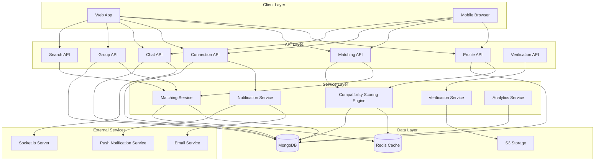
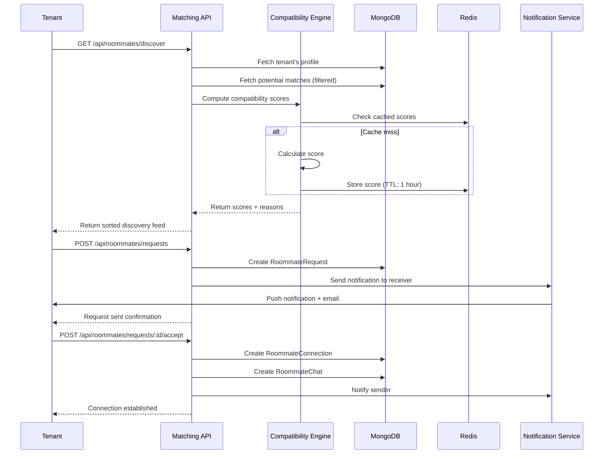

# Design Document: Roommate Matching

## Overview

The Roommate Matching feature enables tenants on the Nestora platform to discover, connect with, and form groups with compatible roommates for shared accommodation. This feature addresses a critical pain point in the student and young professional rental market in Uttar Pradesh, where finding trustworthy, compatible roommates is often more challenging than finding the property itself.

The system uses a multi-factor compatibility scoring algorithm to match tenants based on budget alignment, location preferences, lifestyle habits, schedules, and demographics. Tenants can browse potential matches, send connection requests, chat privately, form groups, and search for properties together. The feature integrates deeply with the existing property search and booking flows while maintaining privacy controls and verification mechanisms to ensure trust and safety.

### Key Design Goals

1. **Compatibility-Driven Matching**: Use a transparent, explainable algorithm that helps tenants understand why they match with specific roommates
2. **Privacy-First**: Give tenants granular control over profile visibility and information sharing
3. **Viral Growth**: Enable social sharing and referrals to drive organic user acquisition
4. **Trust & Safety**: Implement verification, reporting, and moderation to maintain platform integrity
5. **Seamless Integration**: Connect roommate matching with property search and booking flows
6. **Mobile-First**: Optimize for mobile usage patterns common in the target demographic

## Architecture

### System Components

The roommate matching feature consists of the following major components:



### Component Responsibilities

**Profile API**: Handles CRUD operations for roommate profiles, including preferences, lifestyle attributes, and privacy settings.

**Matching API**: Computes compatibility scores, generates match reasons, and serves the discovery feed with filtering and pagination.

**Connection API**: Manages roommate requests (send, accept, reject, withdraw), connection lifecycle, and blocking.

**Chat API**: Handles real-time messaging between connected roommates, including text, images, reactions, and typing indicators.

**Group API**: Manages roommate group formation, invitations, membership, and group chat.

**Search API**: Provides property search functionality tailored for roommate groups, including group match scoring.

**Verification API**: Handles identity verification workflows (phone, document, college verification).

**Compatibility Scoring Engine**: Core algorithm that computes compatibility scores based on multiple weighted factors. Caches scores in Redis for performance.

**Matching Service**: Orchestrates the matching logic, including filtering by privacy settings, verification status, and profile completeness.

**Notification Service**: Sends push notifications and emails for connection requests, messages, and group invitations.

**Verification Service**: Processes verification documents, stores them securely in S3, and updates verification status.

**Analytics Service**: Tracks metrics for roommate matching activity, conversion rates, and algorithm performance.

### Data Flow: Discovery to Connection



### Technology Stack

- **Backend Framework**: Next.js 14 App Router with API routes
- **Database**: MongoDB with Mongoose ODM
- **Caching**: Redis for compatibility score caching and session management
- **Real-time Communication**: Socket.io for chat and presence
- **File Storage**: AWS S3 for verification documents and chat media
- **Authentication**: JWT with refresh tokens (existing auth system)
- **Notifications**: Firebase Cloud Messaging for push, SendGrid for email
- **Image Processing**: Sharp for image optimization and compression

## Components and Interfaces

### API Endpoints

#### Profile Management

**POST /api/roommates/profile**
- Creates or updates the authenticated tenant's roommate profile
- Request body: RoommateProfile object
- Response: Created/updated profile with computed completeness score
- Authorization: Authenticated tenant

**GET /api/roommates/profile**
- Retrieves the authenticated tenant's roommate profile
- Response: RoommateProfile object
- Authorization: Authenticated tenant

**GET /api/roommates/profile/:userId**
- Retrieves another tenant's public roommate profile
- Respects privacy settings (returns limited data for non-connected users)
- Response: Public RoommateProfile object
- Authorization: Authenticated tenant

**PATCH /api/roommates/profile/privacy**
- Updates privacy settings for the authenticated tenant's profile
- Request body: { privacySetting: "public" | "verified_only" | "hidden", hiddenFields: string[] }
- Response: Updated privacy settings
- Authorization: Authenticated tenant

#### Discovery and Matching

**GET /api/roommates/discover**
- Returns paginated list of potential roommate matches
- Query params: page, limit, filters (budget, location, occupation, verificationStatus)
- Response: { matches: MatchResult[], totalCount: number, page: number }
- Authorization: Authenticated tenant with complete profile

**GET /api/roommates/compatibility/:userId**
- Computes compatibility score with a specific user
- Response: { score: number, reasons: string[], breakdown: FactorBreakdown }
- Authorization: Authenticated tenant

**POST /api/roommates/favorites/:userId**
- Adds a potential match to favorites list
- Response: Success confirmation
- Authorization: Authenticated tenant

**GET /api/roommates/favorites**
- Retrieves the authenticated tenant's saved favorites
- Response: Array of MatchResult objects
- Authorization: Authenticated tenant

#### Connection Management

**POST /api/roommates/requests**
- Sends a connection request to another tenant
- Request body: { receiverId: string, message?: string, propertyId?: string }
- Response: Created RoommateRequest object
- Authorization: Authenticated tenant
- Validation: Max 10 pending outgoing requests

**GET /api/roommates/requests/incoming**
- Retrieves incoming connection requests
- Response: Array of RoommateRequest objects with sender profiles
- Authorization: Authenticated tenant

**GET /api/roommates/requests/outgoing**
- Retrieves outgoing connection requests
- Response: Array of RoommateRequest objects with receiver profiles
- Authorization: Authenticated tenant

**POST /api/roommates/requests/:id/accept**
- Accepts an incoming connection request
- Response: Created RoommateConnection and RoommateChat objects
- Authorization: Authenticated tenant (must be receiver)

**POST /api/roommates/requests/:id/reject**
- Rejects an incoming connection request
- Response: Success confirmation
- Authorization: Authenticated tenant (must be receiver)

**DELETE /api/roommates/requests/:id**
- Withdraws an outgoing connection request
- Response: Success confirmation
- Authorization: Authenticated tenant (must be sender)

**GET /api/roommates/connections**
- Retrieves all active roommate connections
- Response: Array of RoommateConnection objects with user profiles
- Authorization: Authenticated tenant

**DELETE /api/roommates/connections/:id**
- Removes a roommate connection
- Response: Success confirmation
- Authorization: Authenticated tenant

**POST /api/roommates/block/:userId**
- Blocks a user and removes connection
- Response: Success confirmation
- Authorization: Authenticated tenant

#### Messaging

**GET /api/roommates/chats**
- Retrieves all roommate chat conversations
- Response: Array of chat objects with last message and unread count
- Authorization: Authenticated tenant

**GET /api/roommates/chats/:chatId/messages**
- Retrieves messages for a specific chat
- Query params: page, limit, before (cursor-based pagination)
- Response: { messages: Message[], hasMore: boolean, cursor: string }
- Authorization: Authenticated tenant (must be participant)

**POST /api/roommates/chats/:chatId/messages**
- Sends a message in a roommate chat
- Request body: { content: string, type: "text" | "image", mediaUrl?: string }
- Response: Created message object
- Authorization: Authenticated tenant (must be participant)
- Real-time: Broadcasts via Socket.io

**POST /api/roommates/chats/:chatId/messages/:messageId/react**
- Adds an emoji reaction to a message
- Request body: { emoji: string }
- Response: Updated message with reactions
- Authorization: Authenticated tenant (must be participant)

**POST /api/roommates/chats/:chatId/seen**
- Marks all messages in a chat as seen
- Response: Success confirmation
- Authorization: Authenticated tenant (must be participant)

**POST /api/roommates/chats/:chatId/typing**
- Sends typing indicator
- Response: Success confirmation (broadcasts via Socket.io)
- Authorization: Authenticated tenant (must be participant)

#### Group Management

**POST /api/roommates/groups**
- Creates a new roommate group
- Request body: { name: string, memberIds: string[] }
- Response: Created RoommateGroup object
- Authorization: Authenticated tenant
- Validation: All members must be connected roommates

**GET /api/roommates/groups**
- Retrieves all groups the authenticated tenant is a member of
- Response: Array of RoommateGroup objects
- Authorization: Authenticated tenant

**GET /api/roommates/groups/:id**
- Retrieves details of a specific group
- Response: RoommateGroup object with member profiles
- Authorization: Authenticated tenant (must be member)

**POST /api/roommates/groups/:id/invite**
- Invites a connected roommate to join the group
- Request body: { userId: string }
- Response: Updated group with pending invitation
- Authorization: Authenticated tenant (must be admin)

**POST /api/roommates/groups/:id/accept**
- Accepts a group invitation
- Response: Updated group with new member
- Authorization: Authenticated tenant (must be invited)

**POST /api/roommates/groups/:id/leave**
- Removes the authenticated tenant from the group
- Response: Success confirmation
- Authorization: Authenticated tenant (must be member)

**DELETE /api/roommates/groups/:id/members/:userId**
- Removes a member from the group
- Response: Updated group
- Authorization: Authenticated tenant (must be admin)

**GET /api/roommates/groups/:id/chat**
- Retrieves group chat messages
- Query params: page, limit, before
- Response: { messages: Message[], hasMore: boolean, cursor: string }
- Authorization: Authenticated tenant (must be member)

**POST /api/roommates/groups/:id/chat**
- Sends a message in group chat
- Request body: { content: string, type: "text" | "image", mediaUrl?: string }
- Response: Created message object
- Authorization: Authenticated tenant (must be member)

#### Group Property Search

**GET /api/roommates/groups/:id/search**
- Searches for properties suitable for the group
- Query params: city, minPrice, maxPrice, amenities, etc.
- Response: Array of properties with group match scores
- Authorization: Authenticated tenant (must be member)

**POST /api/roommates/groups/:id/wishlist/:propertyId**
- Adds a property to the group's shared wishlist
- Response: Updated group wishlist
- Authorization: Authenticated tenant (must be member)

**GET /api/roommates/groups/:id/wishlist**
- Retrieves the group's shared wishlist with member favorites
- Response: Array of properties with member favorite indicators
- Authorization: Authenticated tenant (must be member)

**POST /api/roommates/groups/:id/inquire/:propertyId**
- Sends a property inquiry on behalf of the group
- Request body: { message: string }
- Response: Created inquiry/message
- Authorization: Authenticated tenant (must be member)

#### Verification

**POST /api/roommates/verification/phone**
- Initiates phone verification via OTP
- Request body: { phoneNumber: string }
- Response: { otpSent: boolean }
- Authorization: Authenticated tenant

**POST /api/roommates/verification/phone/verify**
- Verifies phone OTP
- Request body: { phoneNumber: string, otp: string }
- Response: Updated user with phone_verified status
- Authorization: Authenticated tenant

**POST /api/roommates/verification/document**
- Uploads government ID for document verification
- Request body: FormData with document image
- Response: { verificationId: string, status: "pending" }
- Authorization: Authenticated tenant

**POST /api/roommates/verification/college**
- Uploads student ID or enrollment letter for college verification
- Request body: FormData with document image and college name
- Response: { verificationId: string, status: "pending" }
- Authorization: Authenticated tenant

**GET /api/roommates/verification/status**
- Retrieves verification status for the authenticated tenant
- Response: { phoneVerified: boolean, documentVerified: boolean, collegeVerified: boolean, collegeName?: string }
- Authorization: Authenticated tenant

#### Social Sharing

**GET /api/roommates/share/link**
- Generates a shareable link for the authenticated tenant's profile
- Response: { shareUrl: string, previewData: object }
- Authorization: Authenticated tenant

**POST /api/roommates/invite**
- Sends an invitation to join the platform
- Request body: { email?: string, phone?: string }
- Response: { inviteSent: boolean }
- Authorization: Authenticated tenant

**GET /api/roommates/referrals**
- Retrieves referral statistics for the authenticated tenant
- Response: { totalReferrals: number, connectedReferrals: number, badges: string[] }
- Authorization: Authenticated tenant

#### Reporting and Moderation

**POST /api/roommates/report**
- Reports a user for inappropriate behavior
- Request body: { reportedUserId: string, reason: string, evidence: string[], description: string }
- Response: { reportId: string }
- Authorization: Authenticated tenant

**GET /api/admin/roommates/reports**
- Retrieves all pending reports (admin only)
- Response: Array of report objects
- Authorization: Admin

**POST /api/admin/roommates/reports/:id/action**
- Takes action on a report (admin only)
- Request body: { action: "warning" | "suspension" | "ban", duration?: number, reason: string }
- Response: Success confirmation
- Authorization: Admin

#### Analytics

**GET /api/admin/roommates/analytics**
- Retrieves roommate matching metrics (admin only)
- Query params: startDate, endDate, metric
- Response: Analytics data object
- Authorization: Admin

### Socket.io Events

**Client → Server Events**

- `roommate:join_chat` - Join a roommate chat room
- `roommate:leave_chat` - Leave a roommate chat room
- `roommate:typing` - Send typing indicator
- `roommate:stop_typing` - Stop typing indicator
- `roommate:presence` - Update online presence

**Server → Client Events**

- `roommate:message` - New message received
- `roommate:typing` - Other user is typing
- `roommate:stop_typing` - Other user stopped typing
- `roommate:message_seen` - Message marked as seen
- `roommate:reaction` - Reaction added to message
- `roommate:connection_request` - New connection request received
- `roommate:connection_accepted` - Connection request accepted
- `roommate:group_invitation` - Invited to a group
- `roommate:presence_update` - User online/offline status changed

## Data Models

### RoommateProfile

```typescript
interface RoommateProfile {
  _id: ObjectId;
  userId: ObjectId; // Reference to User
  
  // Budget preferences
  budgetRange: {
    min: number; // Minimum monthly rent
    max: number; // Maximum monthly rent
  };
  
  // Location preferences
  locationPreference: {
    cities: string[]; // Preferred cities
    localities: string[]; // Preferred localities within cities
    proximityTo?: {
      type: "college" | "office";
      name: string;
      address: string;
      maxDistanceKm: number;
    };
  };
  
  // Lifestyle preferences
  lifestylePreference: {
    sleepSchedule: {
      bedtime: string; // "22:00" - "02:00"
      wakeTime: string; // "06:00" - "12:00"
    };
    cleanlinessLevel: 1 | 2 | 3 | 4 | 5; // 1=messy, 5=very clean
    noiseTolerance: 1 | 2 | 3 | 4 | 5; // 1=quiet, 5=loud
    guestFrequency: "never" | "rarely" | "sometimes" | "often";
    smoking: boolean;
    drinking: boolean;
    dietaryPreference: "vegetarian" | "non-vegetarian" | "vegan" | "no-preference";
  };
  
  // Occupation details
  occupation: {
    type: "student" | "working_professional" | "freelancer" | "other";
    student?: {
      collegeName: string;
      course: string;
      yearOfStudy: number;
    };
    workingProfessional?: {
      companyName: string;
      officeLocation: string;
    };
  };
  
  // Move-in preferences
  moveInDateRange: {
    earliest: Date;
    latest: Date;
  };
  
  // Roommate preferences
  roommatePreferences: {
    gender: "male" | "female" | "any";
    ageRange: {
      min: number;
      max: number;
    };
  };
  
  // Profile content
  bio: string; // Max 500 characters
  interests: string[]; // Array of interest tags
  
  // Privacy settings
  privacySetting: "public" | "verified_only" | "hidden";
  hiddenFields: string[]; // Fields to hide from non-connected users
  
  // Computed fields
  profileCompleteness: number; // 0-100 percentage
  isComplete: boolean; // true if completeness >= 60%
  
  // Metadata
  createdAt: Date;
  updatedAt: Date;
}
```

### RoommateRequest

```typescript
interface RoommateRequest {
  _id: ObjectId;
  senderId: ObjectId; // Reference to User
  receiverId: ObjectId; // Reference to User
  message?: string; // Optional message from sender
  propertyId?: ObjectId; // Optional property context
  status: "pending" | "accepted" | "rejected" | "withdrawn" | "expired";
  expiresAt: Date; // Auto-expire after 7 days
  createdAt: Date;
  updatedAt: Date;
}
```

### RoommateConnection

```typescript
interface RoommateConnection {
  _id: ObjectId;
  user1Id: ObjectId; // Reference to User
  user2Id: ObjectId; // Reference to User
  requestId: ObjectId; // Reference to RoommateRequest
  chatId: ObjectId; // Reference to RoommateChat
  compatibilityScore: number; // Cached score at connection time
  createdAt: Date;
  updatedAt: Date;
}
```

### RoommateChat

```typescript
interface RoommateChat {
  _id: ObjectId;
  connectionId: ObjectId; // Reference to RoommateConnection
  participants: ObjectId[]; // Array of 2 User IDs
  lastMessage?: {
    content: string;
    senderId: ObjectId;
    timestamp: Date;
  };
  unreadCount: {
    [userId: string]: number; // Unread count per user
  };
  createdAt: Date;
  updatedAt: Date;
}
```

### RoommateMessage

```typescript
interface RoommateMessage {
  _id: ObjectId;
  chatId: ObjectId; // Reference to RoommateChat or GroupChat
  senderId: ObjectId; // Reference to User
  content: string; // Max 2000 characters
  type: "text" | "image";
  mediaUrl?: string; // S3 URL for images
  reactions: {
    userId: ObjectId;
    emoji: string;
  }[];
  seenBy: ObjectId[]; // Array of User IDs who have seen the message
  createdAt: Date;
  updatedAt: Date;
}
```

### RoommateGroup

```typescript
interface RoommateGroup {
  _id: ObjectId;
  name: string;
  adminId: ObjectId; // Reference to User (group creator)
  members: ObjectId[]; // Array of User IDs (2-8 members)
  pendingInvitations: {
    userId: ObjectId;
    invitedAt: Date;
  }[];
  
  // Computed group preferences
  combinedBudgetRange: {
    min: number; // Sum of individual minimums
    max: number; // Sum of individual maximums
    perPerson: {
      min: number; // Total min / group size
      max: number; // Total max / group size
    };
  };
  
  consensusLocationPreference: {
    cities: string[]; // Intersection of all member preferences
    localities: string[];
  };
  
  // Group property search
  sharedWishlist: {
    propertyId: ObjectId;
    addedBy: ObjectId;
    favoritedBy: ObjectId[]; // Members who favorited this property
    addedAt: Date;
  }[];
  
  groupChatId: ObjectId; // Reference to GroupChat
  
  status: "pending" | "active" | "disbanded";
  createdAt: Date;
  updatedAt: Date;
}
```

### GroupChat

```typescript
interface GroupChat {
  _id: ObjectId;
  groupId: ObjectId; // Reference to RoommateGroup
  participants: ObjectId[]; // Array of User IDs
  lastMessage?: {
    content: string;
    senderId: ObjectId;
    timestamp: Date;
  };
  unreadCount: {
    [userId: string]: number;
  };
  createdAt: Date;
  updatedAt: Date;
}
```

### CompatibilityScore (Cached in Redis)

```typescript
interface CompatibilityScore {
  user1Id: string;
  user2Id: string;
  totalScore: number; // 0-100
  breakdown: {
    budgetAlignment: number; // 0-25
    locationAlignment: number; // 0-20
    lifestyleCompatibility: number; // 0-30
    scheduleCompatibility: number; // 0-15
    demographicCompatibility: number; // 0-10
  };
  matchReasons: string[]; // Top 3 reasons for compatibility
  computedAt: Date;
  ttl: number; // Time to live in seconds (3600 = 1 hour)
}
```

### RoommateReport

```typescript
interface RoommateReport {
  _id: ObjectId;
  reporterId: ObjectId; // Reference to User
  reportedUserId: ObjectId; // Reference to User
  reason: "fake_profile" | "harassment" | "spam" | "inappropriate_content" | "other";
  description: string;
  evidence: string[]; // Array of screenshot URLs or message IDs
  status: "pending" | "under_review" | "resolved" | "dismissed";
  adminNotes?: string;
  actionTaken?: {
    type: "warning" | "suspension" | "ban";
    duration?: number; // Days (for suspension)
    reason: string;
    actionedBy: ObjectId; // Admin User ID
    actionedAt: Date;
  };
  createdAt: Date;
  updatedAt: Date;
}
```

### VerificationDocument

```typescript
interface VerificationDocument {
  _id: ObjectId;
  userId: ObjectId; // Reference to User
  type: "government_id" | "college_id";
  documentUrl: string; // S3 URL
  status: "pending" | "approved" | "rejected";
  metadata?: {
    collegeName?: string; // For college verification
    documentType?: string; // "aadhaar" | "pan" | "driving_license" | "student_id"
  };
  reviewedBy?: ObjectId; // Admin User ID
  reviewedAt?: Date;
  rejectionReason?: string;
  expiresAt: Date; // Auto-delete after 30 days of approval
  createdAt: Date;
  updatedAt: Date;
}
```

### RoommateAnalytics (Admin Dashboard)

```typescript
interface RoommateAnalytics {
  date: Date;
  metrics: {
    profilesCreated: number;
    profilesCompleted: number; // Completeness >= 60%
    requestsSent: number;
    requestsAccepted: number;
    requestsRejected: number;
    connectionsActive: number;
    groupsFormed: number;
    groupSearches: number;
    propertyInquiriesFromGroups: number;
    bookingsFromGroups: number;
    averageCompatibilityScore: number;
    verificationsPending: number;
    verificationsApproved: number;
    reportsSubmitted: number;
  };
  conversionRates: {
    profileToRequest: number; // % of profiles that send requests
    requestToConnection: number; // % of requests accepted
    connectionToGroup: number; // % of connections that form groups
    groupToSearch: number; // % of groups that search properties
    searchToBooking: number; // % of group searches that result in bookings
  };
}
```


## Correctness Properties

*A property is a characteristic or behavior that should hold true across all valid executions of a system—essentially, a formal statement about what the system should do. Properties serve as the bridge between human-readable specifications and machine-verifiable correctness guarantees.*

After analyzing all acceptance criteria, I've identified properties that can be combined or are redundant:

- Privacy visibility rules (3.5, 3.6, 9.2, 9.3, 9.4) can be consolidated into comprehensive privacy properties
- Notification properties (4.3, 13.1, 13.2, 13.3, 13.4) share similar patterns and can be grouped
- Sorting properties (3.1, 7.3) follow the same pattern
- Connection creation cascades (4.5, 4.6) can be combined

### Property 1: Profile Completeness Calculation

*For any* roommate profile, the profile completeness percentage should equal the count of non-empty required fields divided by the total number of required fields, multiplied by 100.

**Validates: Requirements 1.12**

### Property 2: Incomplete Profile Exclusion

*For any* roommate profile with completeness below 60%, that profile should be marked as incomplete and excluded from all discovery feed results.

**Validates: Requirements 1.13**

### Property 3: Compatibility Score Composition

*For any* pair of roommate profiles, the total compatibility score should equal the sum of budget alignment (max 25), location alignment (max 20), lifestyle compatibility (max 30), schedule compatibility (max 15), and demographic compatibility (max 10), with the total never exceeding 100.

**Validates: Requirements 2.1**

### Property 4: Budget Alignment Scoring

*For any* two budget ranges, if the overlap is 80% or more of the smaller range, budget alignment should award full points (25), and proportionally fewer points for smaller overlaps, down to 0 points for no overlap.

**Validates: Requirements 2.2**

### Property 5: Location Alignment Scoring

*For any* two location preferences, if preferred cities match and localities overlap, location alignment should award full points (20), and partial points for city-only matches, with no points for completely different cities.

**Validates: Requirements 2.3**

### Property 6: Lifestyle Compatibility Scoring

*For any* two lifestyle preferences, the lifestyle compatibility score should award points for matching attributes (cleanliness, noise tolerance, guest frequency, smoking, drinking) and deduct points for conflicting attributes, with the total bounded between 0 and 30.

**Validates: Requirements 2.4**

### Property 7: Schedule Compatibility Scoring

*For any* two sleep schedules, the schedule compatibility score should award more points for similar bedtimes and wake times, with maximum 15 points for identical schedules and 0 points for completely opposite schedules.

**Validates: Requirements 2.5**

### Property 8: Demographic Compatibility Scoring

*For any* two demographic profiles, the demographic compatibility score should consider age range overlap, gender preference compatibility, and occupation type similarity, with a maximum of 10 points.

**Validates: Requirements 2.6**

### Property 9: Match Reason Generation

*For any* compatibility score computation, the system should generate exactly 3 match reason strings corresponding to the top 3 scoring factors from the breakdown.

**Validates: Requirements 2.7**

### Property 10: Low Score Exclusion

*For any* pair of profiles with compatibility score below 40, that pairing should be excluded from the discovery feed.

**Validates: Requirements 2.8**

### Property 11: Score Recomputation on Profile Update

*For any* profile update, all cached compatibility scores involving that profile should be invalidated and recomputed on next access.

**Validates: Requirements 2.9**

### Property 12: Discovery Feed Sorting

*For any* discovery feed result set, all matches should be sorted by compatibility score in descending order, with no two consecutive entries having a higher score than the previous.

**Validates: Requirements 3.1, 7.3**

### Property 13: Discovery Feed Required Fields

*For any* match in the discovery feed, the response should include profile photo, name, age, occupation, compatibility score, and exactly 3 match reason strings.

**Validates: Requirements 3.2**

### Property 14: Discovery Feed Filtering

*For any* discovery feed request with filters applied (budget, location, occupation, verification status), all returned matches should satisfy all specified filter criteria.

**Validates: Requirements 3.3**

### Property 15: Discovery Feed Pagination

*For any* paginated discovery feed, each page should contain at most 20 results, and no profile should appear on multiple pages within the same query.

**Validates: Requirements 3.4**

### Property 16: Privacy-Based Visibility

*For any* profile with privacy setting "verified_only", that profile should only appear in discovery feeds for users with verification status of "document_verified" or "college_verified". For any profile with privacy setting "hidden", that profile should never appear in any discovery feed.

**Validates: Requirements 3.5, 3.6, 9.3, 9.4**

### Property 17: Verification Badge Display

*For any* user with verification status "college_verified", their profile in the discovery feed should include a verification badge indicator.

**Validates: Requirements 3.7, 8.5**

### Property 18: Favorites List Addition

*For any* tenant favoriting a potential match, that match should be added to the tenant's favorites list and retrievable via the favorites endpoint.

**Validates: Requirements 3.8**

### Property 19: Pending Request Exclusion

*For any* tenant viewing the discovery feed, profiles to whom they have already sent pending roommate requests should be excluded from the results.

**Validates: Requirements 3.9**

### Property 20: Request Creation

*For any* connection request sent to a potential match, a RoommateRequest object should be created with sender ID, receiver ID, optional message, optional property ID, status "pending", and expiration date 7 days in the future.

**Validates: Requirements 4.1**

### Property 21: Pending Request Limit

*For any* tenant with 10 pending outgoing roommate requests, attempting to send an 11th request should fail with an error indicating the limit has been reached.

**Validates: Requirements 4.2**

### Property 22: Connection Acceptance Cascade

*For any* accepted roommate request, the system should create both a RoommateConnection object linking the two users and a RoommateChat object for their conversation.

**Validates: Requirements 4.5, 4.6**

### Property 23: Rejection Hiding

*For any* rejected roommate request, the sender should be permanently excluded from the receiver's future discovery feed results.

**Validates: Requirements 4.7**

### Property 24: Request Withdrawal

*For any* pending roommate request, the sender should be able to withdraw it, resulting in the request being deleted and no longer appearing in either user's request lists.

**Validates: Requirements 4.9**

### Property 25: Message Length Validation

*For any* text message in a roommate chat, if the content exceeds 2000 characters, the message should be rejected with a validation error.

**Validates: Requirements 5.1**

### Property 26: Image Count Validation

*For any* message with images in a roommate chat, if more than 5 images are attached, the message should be rejected with a validation error.

**Validates: Requirements 5.2**

### Property 27: Message Metadata Presence

*For any* message in a roommate chat, the response should include a timestamp and read receipt information (seenBy array).

**Validates: Requirements 5.3**

### Property 28: Block Cascade

*For any* tenant blocking another tenant, the system should delete the RoommateConnection between them and mark all messages as deleted for the blocking user.

**Validates: Requirements 5.7**

### Property 29: Reaction Addition

*For any* message in a roommate chat, adding an emoji reaction should append the reaction to the message's reactions array with the user ID and emoji.

**Validates: Requirements 5.9**

### Property 30: Group Size Validation

*For any* roommate group creation request, if the number of invited members is less than 1 or greater than 7, the request should be rejected with a validation error.

**Validates: Requirements 6.1**

### Property 31: Group Invitation Notifications

*For any* roommate group creation, all invited members should receive invitation notifications.

**Validates: Requirements 6.2**

### Property 32: Group Activation Requirement

*For any* roommate group with pending invitations, the group status should remain "pending" until all invited members accept, at which point it should transition to "active".

**Validates: Requirements 6.3**

### Property 33: Group Chat Creation

*For any* roommate group transitioning to "active" status, a GroupChat object should be automatically created with all group members as participants.

**Validates: Requirements 6.4**

### Property 34: Admin-Only Member Removal

*For any* attempt to remove a member from a roommate group, the operation should only succeed if the requester is the group admin.

**Validates: Requirements 6.6**

### Property 35: Member Leave Notification

*For any* member leaving a roommate group, all remaining members should receive a notification about the departure.

**Validates: Requirements 6.8**

### Property 36: Combined Budget Calculation

*For any* active roommate group, the combined budget range should have a minimum equal to the sum of all members' minimum budgets, a maximum equal to the sum of all members' maximum budgets, and per-person values equal to the totals divided by group size.

**Validates: Requirements 6.9**

### Property 37: Consensus Location Calculation

*For any* active roommate group, the consensus location preference should contain only cities that appear in all members' preferences, and only localities that appear in all members' preferences for those cities.

**Validates: Requirements 6.10**

### Property 38: Group Property Bedroom Filter

*For any* group property search, all returned properties should have a bedroom count greater than or equal to the group size.

**Validates: Requirements 7.1**

### Property 39: Group Match Score Computation

*For any* property in a group search, the group match score should be computed based on how well the property's price fits the group's combined budget range and how well the property's location matches the group's consensus location preference.

**Validates: Requirements 7.2**

### Property 40: Group Wishlist Addition

*For any* group member adding a property to the shared wishlist, the property should appear in the group's wishlist with the adding member's ID recorded.

**Validates: Requirements 7.4**

### Property 41: Wishlist Favorite Indicators

*For any* property in a group's shared wishlist, the response should include an array of member IDs who have favorited that property.

**Validates: Requirements 7.5**

### Property 42: Group Inquiry Permission

*For any* member of an active roommate group, that member should be able to initiate a property inquiry on behalf of the group.

**Validates: Requirements 7.6**

### Property 43: Group Inquiry Context

*For any* property inquiry sent by a group member, the inquiry should include the group ID and indicate to the property owner that it's from a roommate group.

**Validates: Requirements 7.7**

### Property 44: Group Search Display Fields

*For any* group property search interface, the response should include the number of bedrooms required (equal to group size) and the total group budget range.

**Validates: Requirements 7.8**

### Property 45: Verified User Prioritization

*For any* discovery feed with both verified and unverified users having the same compatibility score, verified users should appear before unverified users in the results.

**Validates: Requirements 8.6**

### Property 46: Verification Filter

*For any* discovery feed request with verification filter enabled, all returned matches should have verification status of "document_verified" or "college_verified".

**Validates: Requirements 8.7**

### Property 47: Public Profile Visibility

*For any* profile with privacy setting "public", that profile should be visible in discovery feeds to all tenants with complete profiles (completeness >= 60%).

**Validates: Requirements 9.2**

### Property 48: Privacy Setting Update

*For any* tenant updating their privacy setting, the change should take effect immediately and be reflected in subsequent discovery feed queries.

**Validates: Requirements 9.5**

### Property 49: Field-Level Privacy

*For any* profile with hidden fields configured, those specific fields should be excluded from the profile data returned to non-connected users, but included for connected users.

**Validates: Requirements 9.6**

### Property 50: Connection-Based Name Visibility

*For any* non-connected user viewing a profile, only the first name and age should be visible, while connected users should see the full name.

**Validates: Requirements 9.7**

### Property 51: Property-Specific Roommate Matching

*For any* property-specific roommate search, all returned potential roommates should have budget ranges that include the property's price and location preferences that include the property's location.

**Validates: Requirements 10.2**

### Property 52: Property-Specific Request Context

*For any* property-specific roommate request, the created RoommateRequest should include the property ID in its propertyId field.

**Validates: Requirements 10.3**

### Property 53: Property Request Acceptance Wishlist Update

*For any* accepted property-specific roommate request, the associated property should be added to both the sender's and receiver's personal wishlists.

**Validates: Requirements 10.4**

### Property 54: Active Seeker Count

*For any* shared property, the displayed count of active roommate seekers should equal the number of tenants with complete profiles whose budget range includes the property price and location preference includes the property location.

**Validates: Requirements 10.5**

### Property 55: Roommate-Enabled Property Priority

*For any* group property search, properties with "Roommate Matching Enabled" flag set to true should have higher ranking than properties with the same group match score but flag set to false.

**Validates: Requirements 10.7**

### Property 56: Shareable Link Uniqueness

*For any* two different roommate profiles, their generated shareable links should be unique and not collide.

**Validates: Requirements 11.1**

### Property 57: Share Preview Score Exclusion

*For any* shareable profile link preview, the compatibility score should not be included in the public preview data.

**Validates: Requirements 11.2**

### Property 58: Referral Tracking

*For any* new user signing up via a shareable profile link, the system should record a referral relationship between the new user and the profile owner.

**Validates: Requirements 11.4**

### Property 59: Social Connector Badge Award

*For any* roommate connection created where one user was referred by the other, both users should receive a "Social Connector" badge.

**Validates: Requirements 11.5**

### Property 60: Mutual Connection Count

*For any* two potential roommates in the discovery feed, the displayed mutual connection count should equal the number of users who are connected to both of them.

**Validates: Requirements 11.6**

### Property 61: Request Notification Delivery

*For any* created roommate request, the receiver should receive both a push notification and an email notification.

**Validates: Requirements 4.3, 13.1**

### Property 62: Acceptance Notification Delivery

*For any* accepted roommate request, the sender should receive a push notification.

**Validates: Requirements 13.2**

### Property 63: Message Notification Delivery

*For any* message sent in a roommate chat, if the recipient is not currently viewing the chat, they should receive a push notification.

**Validates: Requirements 13.3**

### Property 64: Group Invitation Notification Delivery

*For any* group invitation sent, the invited user should receive both a push notification and an email notification.

**Validates: Requirements 13.4**

### Property 65: High-Score Match Notification

*For any* new user joining the platform with a complete profile, all existing users with compatibility score above 80 with the new user should receive a notification.

**Validates: Requirements 13.5**

### Property 66: Notification Rate Limiting

*For any* tenant in any one-hour period, the total number of notifications sent should not exceed 5, with additional notifications batched for the next hour.

**Validates: Requirements 13.7**

### Property 67: Report Evidence Collection

*For any* submitted report, the system should store all provided evidence including screenshot URLs and message IDs in the report record.

**Validates: Requirements 14.2**

### Property 68: Ban Cascade

*For any* tenant being banned, all their RoommateConnections should be deleted and they should be removed from all RoommateGroups they are members of.

**Validates: Requirements 14.5**

### Property 69: Automatic Report Flagging

*For any* tenant accumulating 3 or more reports, their account should be automatically flagged for admin review.

**Validates: Requirements 14.6**

## Error Handling

### Validation Errors

**Profile Validation**
- Budget range: minimum must be less than maximum, both must be positive
- Age range: minimum must be less than maximum, both must be between 18 and 100
- Bio: maximum 500 characters
- Move-in dates: earliest must be before latest, both must be in the future

**Request Validation**
- Cannot send request to self
- Cannot send request to already connected user
- Cannot send request if already pending
- Cannot exceed 10 pending outgoing requests
- Receiver must have complete profile

**Group Validation**
- Group size must be between 2 and 8 members
- All invited members must be connected roommates
- Cannot invite same user twice
- Admin cannot remove themselves (must leave instead)

**Message Validation**
- Content cannot be empty for text messages
- Content maximum 2000 characters
- Maximum 5 images per message
- Image files must be valid formats (JPEG, PNG, WebP)
- Maximum image size 10MB per image

### Authentication Errors

- 401 Unauthorized: Missing or invalid JWT token
- 403 Forbidden: Insufficient permissions (e.g., non-admin accessing admin endpoints)
- 403 Forbidden: Incomplete profile attempting to access discovery feed

### Resource Not Found Errors

- 404 Not Found: Profile, request, connection, group, or chat does not exist
- 404 Not Found: User ID does not exist

### Conflict Errors

- 409 Conflict: Request already exists between users
- 409 Conflict: Connection already exists between users
- 409 Conflict: User already in group

### Rate Limiting

- 429 Too Many Requests: Exceeded API rate limits (100 requests per minute per user)
- 429 Too Many Requests: Exceeded notification rate limits (5 per hour)

### External Service Errors

- 500 Internal Server Error: Database connection failure
- 500 Internal Server Error: Redis cache unavailable
- 500 Internal Server Error: S3 upload failure
- 500 Internal Server Error: Socket.io server unavailable
- 503 Service Unavailable: Email service unavailable
- 503 Service Unavailable: Push notification service unavailable

### Error Response Format

All errors follow a consistent JSON structure:

```json
{
  "error": {
    "code": "ERROR_CODE",
    "message": "Human-readable error message",
    "details": {
      "field": "Additional context about the error"
    }
  }
}
```

### Retry Strategy

- Transient errors (500, 503): Exponential backoff with 3 retries
- Rate limit errors (429): Wait for rate limit window to reset
- Validation errors (400, 409): No retry, return error to client
- Authentication errors (401, 403): No retry, redirect to login

## Testing Strategy

### Dual Testing Approach

The roommate matching feature requires both unit tests and property-based tests to ensure comprehensive coverage:

**Unit Tests** focus on:
- Specific examples demonstrating correct behavior
- Edge cases (empty lists, boundary values, null handling)
- Error conditions and validation failures
- Integration points between components
- Time-based behaviors (expiration, scheduling)
- External service mocking (Socket.io, email, push notifications)

**Property-Based Tests** focus on:
- Universal properties that hold for all inputs
- Comprehensive input coverage through randomization
- Invariants that must be maintained across operations
- Compatibility score computation correctness
- Privacy and visibility rules
- Data consistency across related entities

### Property-Based Testing Configuration

**Framework**: Use `fast-check` for TypeScript/JavaScript property-based testing

**Configuration**:
- Minimum 100 iterations per property test
- Seed-based reproducibility for failed tests
- Shrinking enabled to find minimal failing examples

**Test Tagging**: Each property test must include a comment referencing the design property:

```typescript
// Feature: roommate-matching, Property 3: Compatibility Score Composition
test('compatibility score equals sum of weighted factors', () => {
  fc.assert(
    fc.property(
      roommateProfileArbitrary(),
      roommateProfileArbitrary(),
      (profile1, profile2) => {
        const score = computeCompatibilityScore(profile1, profile2);
        const sum = score.breakdown.budgetAlignment +
                    score.breakdown.locationAlignment +
                    score.breakdown.lifestyleCompatibility +
                    score.breakdown.scheduleCompatibility +
                    score.breakdown.demographicCompatibility;
        expect(score.totalScore).toBe(sum);
        expect(score.totalScore).toBeLessThanOrEqual(100);
      }
    ),
    { numRuns: 100 }
  );
});
```

### Test Organization

```
tests/
├── unit/
│   ├── profile/
│   │   ├── profile-creation.test.ts
│   │   ├── profile-validation.test.ts
│   │   └── privacy-settings.test.ts
│   ├── matching/
│   │   ├── compatibility-scoring.test.ts
│   │   ├── discovery-feed.test.ts
│   │   └── filtering.test.ts
│   ├── connections/
│   │   ├── request-lifecycle.test.ts
│   │   ├── connection-management.test.ts
│   │   └── blocking.test.ts
│   ├── messaging/
│   │   ├── chat-creation.test.ts
│   │   ├── message-sending.test.ts
│   │   └── reactions.test.ts
│   ├── groups/
│   │   ├── group-formation.test.ts
│   │   ├── group-search.test.ts
│   │   └── group-wishlist.test.ts
│   └── verification/
│       ├── phone-verification.test.ts
│       ├── document-verification.test.ts
│       └── college-verification.test.ts
├── property/
│   ├── profile-properties.test.ts
│   ├── scoring-properties.test.ts
│   ├── discovery-properties.test.ts
│   ├── connection-properties.test.ts
│   ├── messaging-properties.test.ts
│   ├── group-properties.test.ts
│   ├── privacy-properties.test.ts
│   └── notification-properties.test.ts
├── integration/
│   ├── end-to-end-matching.test.ts
│   ├── group-property-search.test.ts
│   └── real-time-messaging.test.ts
└── arbitraries/
    ├── profile-arbitrary.ts
    ├── request-arbitrary.ts
    ├── group-arbitrary.ts
    └── message-arbitrary.ts
```

### Key Test Scenarios

**Profile Management**
- Creating profiles with various completeness levels
- Updating profiles and verifying score recomputation
- Privacy setting changes and visibility impact
- Field-level privacy for connected vs non-connected users

**Compatibility Scoring**
- All factor combinations (budget, location, lifestyle, schedule, demographics)
- Edge cases (identical profiles, completely opposite profiles)
- Score caching and invalidation
- Match reason generation accuracy

**Discovery Feed**
- Sorting by compatibility score
- Filtering by multiple criteria simultaneously
- Pagination without duplicates
- Privacy-based visibility rules
- Pending request exclusion

**Connection Lifecycle**
- Request creation and limits
- Acceptance cascade (connection + chat creation)
- Rejection and permanent hiding
- Withdrawal and cleanup
- Blocking and cascade deletion

**Messaging**
- Message validation (length, image count)
- Real-time delivery via Socket.io
- Read receipts and typing indicators
- Reactions and emoji handling
- Message history retention

**Group Formation**
- Size validation (2-8 members)
- Invitation and acceptance flow
- Group activation and chat creation
- Combined budget calculation
- Consensus location computation
- Member removal and leave notifications

**Group Property Search**
- Bedroom count filtering
- Group match score computation
- Shared wishlist management
- Property inquiry on behalf of group

**Verification**
- Phone OTP flow
- Document upload and approval
- College verification workflow
- Badge display in discovery feed
- Verified user prioritization

**Notifications**
- Request notifications (push + email)
- Message notifications (push only)
- Group invitation notifications (push + email)
- High-score match notifications
- Rate limiting (max 5 per hour)

### Performance Testing

**Load Testing Scenarios**:
- 1000 concurrent users browsing discovery feed
- 500 concurrent real-time chat connections
- 100 compatibility score computations per second
- 50 group searches per second

**Performance Targets**:
- Discovery feed response time: < 500ms (p95)
- Compatibility score computation: < 100ms (p95)
- Message delivery latency: < 200ms (p95)
- Group search response time: < 1000ms (p95)

**Caching Strategy**:
- Compatibility scores: 1 hour TTL in Redis
- Discovery feed results: 5 minute TTL in Redis
- User profiles: 15 minute TTL in Redis
- Group data: 10 minute TTL in Redis

### Security Testing

- SQL injection prevention (parameterized queries)
- XSS prevention (input sanitization)
- CSRF protection (token validation)
- Rate limiting enforcement
- JWT token validation and expiration
- File upload validation (type, size, content)
- Privacy setting enforcement
- Authorization checks (admin-only endpoints)

### Monitoring and Observability

**Metrics to Track**:
- API endpoint latency (p50, p95, p99)
- Error rates by endpoint and error type
- Compatibility score computation time
- Cache hit/miss rates
- Socket.io connection count
- Message delivery success rate
- Notification delivery success rate
- Database query performance

**Alerts**:
- Error rate > 5% for any endpoint
- API latency p95 > 1000ms
- Cache hit rate < 80%
- Socket.io connection failures > 10/minute
- Notification delivery failure rate > 5%
- Database connection pool exhaustion

